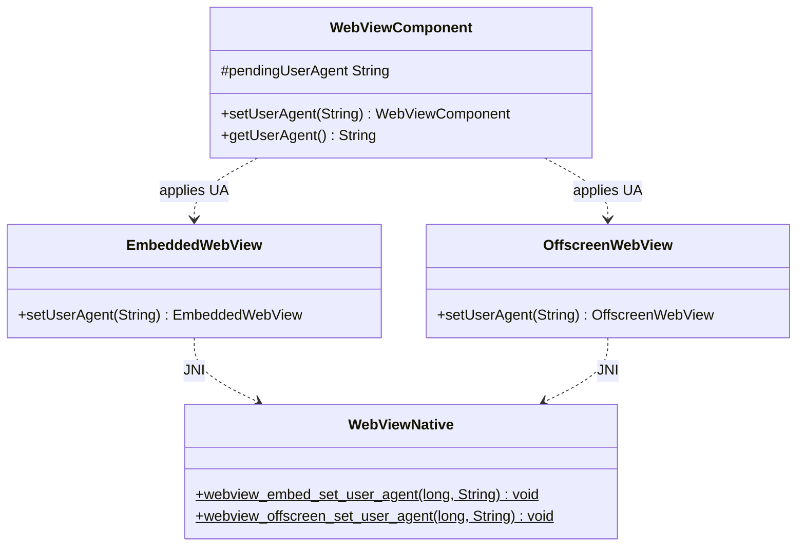

# REASONS Canvas: Custom User-Agent for the Embedded WebView

## R · Requirements

- Let callers override the embedded WebView's **User-Agent** so web
  apps that gate on the UA string accept the embedded browser. Expose
  `WebViewComponent.setUserAgent(String)` / `getUserAgent()`, wired to
  each engine's native custom-UA facility so the override changes the
  **actual HTTP `User-Agent` request header** (not merely the
  JS-visible `navigator.userAgent`). This is the header a server sees.

- **Why.** WKWebView's default UA omits the `Version/… Safari/…`
  tokens (`Mozilla/5.0 (Macintosh; Intel Mac OS X 10_15_7)
  AppleWebKit/605.1.15 (KHTML, like Gecko)`), so UA-sniffing sites
  reject it as "unsupported browser". A JS `navigator.userAgent` shim
  cannot fix server-side sniffing; only an engine-level custom UA can.

- **Contract.**
  - `setUserAgent(String ua)` — store the UA and apply it to the
    engine. `null` or empty **restores the engine default** (clears
    the override). May be called **before display** (stored, applied
    at peer attach, so the first request carries it) or **after**
    (applied live; takes effect on the next navigation — engines do
    not retro-rewrite the current page's request).
  - `getUserAgent()` — returns the pending/applied override, or
    `null` when none is set (engine default in force).
  - Accessor style follows `setUrl`/`getUrl` (get-style), not the
    no-`get` event style.

- **Backward compatible.** When `setUserAgent` is never called,
  `pendingUserAgent` is `null`, the native setter is never invoked,
  and the engine's default UA is used — byte-for-byte today's
  behaviour.

- **Popup inheritance.** A browser-initiated popup
  (`window.open` / `target="_blank"` / POST-to-new-window),
  whether **adopted** into a caller-supplied `WebViewComponent` tab
  (ADOPT) or hosted in an **engine-owned window** (NATIVE_WINDOW),
  inherits the opener's custom User-Agent. The override is applied
  to the newly created popup child **before its initial (in-flight)
  navigation**, so the popup's **first** request carries the opener's
  UA — not the engine default. When the opener has no override, the
  child keeps the engine default. This holds on macOS and Linux.
  **It does NOT hold on Windows** — see the known limitation below.
  **Why.** `customUserAgent` (and its per-engine analogues)
  is a per-view **instance** property, not part of the
  `WKWebViewConfiguration` / related-view linkage the child inherits
  from the opener, so without explicit propagation the popup's first
  request goes out with the engine default UA — on macOS that lacks
  the `Safari` token, so UA-gating sites (e.g. Cloudbeds `/connect/…`,
  which 301s any non-Safari UA to `/browsererror`) block the popup
  even though the opener tab loads fine. Cross-references the popup
  canvases that own the child-creation sites: Canvas 15 (`window.open`
  / macOS), Canvas 16/17 (native-window Linux/Windows), and Canvas
  18/19/20 (popup adoption macOS/Linux/Windows).

- **KNOWN LIMITATION — a pop-up child's User-Agent cannot be set on
  WebView2.** Verified on-device: the propagation site runs, chooses a
  UA (from the resolver or the opener's tracked override), and
  `put_UserAgent` on the **child** returns `S_OK` — and the child's
  first request still goes out with the engine default. By the time
  `NewWindowRequested` hands us the child, WebView2 has already
  committed that navigation, and a settings write cannot overtake it.
  This is the same defect shape as the empty-string reset (Approach 2):
  WebView2 accepts a settings write and does not necessarily act on it.
  It applies equally to the 1.5.0 resolver and to the 1.3.1 opener-copy,
  so **pop-up UA propagation has never worked on Windows**, and the
  claim above that it did was never validated on-device.
  The fallback behaviour is safe rather than wrong: a Windows pop-up
  presents the engine's own (Chromium/Edge) UA, which is a truthful,
  mainstream string that UA-gating sites accept — the failure mode the
  propagation exists to prevent is a macOS/WebKit one. Callers who need
  a specific UA in a Windows pop-up must currently open the destination
  in a normal tab instead.
  The candidate fix is `ICoreWebView2_2::add_WebResourceRequested` with
  a filter on the child, rewriting the `User-Agent` **request header**
  rather than the setting — per-request, so it cannot lose a race with a
  navigation. Deliberately not attempted blind: it is non-trivial COM on
  a path that currently preserves `window.opener` and the in-flight POST
  body (Canvas 18 D7), and breaking either of those to fix a UA would be
  a bad trade.

- **Per-host User-Agent resolver (1.5.0).** Let a caller supply a
  *resolver* — a function from the URL a navigation is about to load
  to the User-Agent to present for it — so one embedded browser can
  show a different UA per destination host. Expose
  `WebViewComponent.setUserAgentResolver(Function<String,String>)` and
  `getUserAgentResolver()`, plumbed through the same
  pending-value-then-apply-at-attach path `setUserAgent` already uses.

- **Why a resolver, not just a string.** A single static UA cannot
  satisfy two sites with opposite demands. Slack rejects the engine's
  own UA as an unsupported browser and needs a mainstream desktop
  Chrome string; Google's sign-in, by contrast, scores a Chrome UA
  presented by a WebKit engine as a spoof — the claimed Chrome build
  has no `navigator.userAgentData`, sends no `Sec-CH-UA` client
  hints, and carries a WebKit TLS fingerprint — and answers with a
  CAPTCHA that cannot be passed at any score. Choosing the UA per
  destination host is the only way to serve both from one browser.

- **Resolver precedence.** Resolver result when non-null and
  non-blank → the static `setUserAgent` value → the engine default
  (`null`). A `null` or blank resolver return means **fall through**,
  *not* "engine default": only the absence of both a resolver result
  and a static override yields the engine default. When no resolver is
  set, behaviour is byte-for-byte that of 1.4.0.

- **Consulted at exactly three points**, each a navigation that is
  about to start and that this library controls: (a) before a view's
  **initial** navigation (peer attach / first `setUrl`); (b) before any
  **Java-initiated `setUrl`** on an already-live view; (c) before a
  browser-initiated **popup child's first** navigation, keyed on the
  **popup's own target URL**.

- **Supersedes popup inheritance when a resolver is set.** Point (c)
  replaces the blanket copy of the opener's override described in the
  Popup inheritance requirement above: the child's UA is chosen from
  the child's target URL rather than inherited from the opener. The
  popup is the case that needs this most — an OAuth sign-in opened
  from a site that requires a spoofed UA lands on an identity provider
  that penalises exactly that spoof. When **no** resolver is set, the
  opener-copy behaviour is retained unchanged.

- **Resolver threading and failure.** The resolver is invoked on the
  engine UI thread immediately before the navigation it governs, so it
  must be fast and must not block. A resolver that throws is swallowed
  and treated as a `null` return (fall through to the static UA): a
  resolver must never be able to break a navigation.

- **Rejected alternative — true per-navigation interception.** The
  resolver deliberately does **not** provide per-request or mid-page UA
  switching: a server-side redirect that crosses hosts *during* a
  navigation keeps the UA that navigation started with. Intercepting
  every navigation via the macOS `WKNavigationDelegate`
  `webView:decidePolicyForNavigationAction:decisionHandler:` — cancel
  the action, set `customUserAgent`, re-issue the request — was
  considered and **rejected**: WebKit does not reliably expose
  `NSURLRequest.HTTPBody` to that delegate for form POSTs, so
  re-issuing would silently drop OAuth form-post bodies. That is the
  same class of breakage Canvas 18 D7 already avoids by never
  re-`setUrl`-ing an adopted popup. Presenting a slightly stale UA
  after a cross-host redirect is a far smaller defect than losing a
  sign-in POST.

- Definition of Done:
  - `wv.setUserAgent("…Safari…")` before display makes the first and
    subsequent navigations send that `User-Agent` header on all three
    engines.
  - `setUserAgent(null)` / `setUserAgent("")` reverts to the engine
    default.
  - `getUserAgent()` reflects the last set value (`null` when unset).
  - A headless `WebViewComponentUserAgentTest` verifies the Java
    store/reset/get contract without a native peer.
  - README gains a "Custom user agent" subsection.
  - On-device: `WebViewAdoptPopupDemo` (shared with Canvas 18) grows a
    User-Agent field + Set/Reset so the real HTTP header change is
    verifiable via an httpbin echo; run with
    `./run-mac-adopt-popup-demo.sh`.
  - A popup opened from an opener that has a custom UA sends that UA on
    its **first** (and subsequent) request on all three engines, for
    both the ADOPT and NATIVE_WINDOW dispositions; an opener at the
    engine default yields a popup at the engine default. Verifiable in
    `WebViewAdoptPopupDemo`: the `window.open → popup` button opens
    `https://httpbin.org/user-agent`, which echoes the popup's UA.
  - `setUserAgentResolver` chooses the UA per destination host at all
    three consultation points; a headless
    `WebViewComponentUserAgentResolverTest` verifies precedence
    (resolver → static → default), fall-through on a `null`/blank
    return, and that a throwing resolver falls through instead of
    propagating.
  - A popup opened toward a host the resolver maps to a distinct UA
    sends **that** UA on its first request — not the opener's — on
    **macOS and Linux**, for both ADOPT and NATIVE_WINDOW. Verifiable in
    `WebViewAdoptPopupDemo` via its resolver toggle plus the
    `https://httpbin.org/user-agent` echo. **Windows is excluded** by the
    known limitation above: its pop-up children keep the engine default,
    and the diagnostic log is the evidence that the failure is the
    engine's rather than this library's.
  - **Point (b) is verifiable on-device, no pop-up involved.** With the
    resolver toggle **on**, navigating the opener (address bar or the
    one-click buttons) to the **overridden** host echoes the resolver's
    UA, while navigating to the **not-overridden** host echoes the
    User-Agent field's value — per-host selection and fall-through
    demonstrated on one engine in two clicks. With the toggle **off**,
    both hosts echo the field's value. This closes the gap where point
    (b) was covered only by the headless test and could not be shown on
    any engine.
  - README gains a "Per-host user agent" subsection covering the
    resolver, its precedence, the three consultation points, and the
    cross-host-redirect limitation.

- Out of scope: per-request / mid-navigation UA switching (see the
  rejected alternative above); UA-Client-Hints
  (`Sec-CH-UA`) customisation; spoofing `navigator.userAgent` from
  Java (that is a caller-side `addOnBeforeLoad` concern); the
  standalone in-process `WebView` class (embedded surface only, same
  boundary as Canvas 15/18).

## E · Entities

- **WebViewComponent** (modified). Gains:
  - `protected String pendingUserAgent = null;` (adjacent to
    `pendingUrl`/`debug`).
  - `public WebViewComponent setUserAgent(String ua)` — normalise
    empty to `null`, store, and apply live to the peer if attached.
  - `public String getUserAgent()` — return `pendingUserAgent`.
- **WebViewHeavyweightComponent** (modified). In `createPeer()`, after
  `EmbeddedWebView.attach`/`adopt` and **before** the initial
  `navigate`, apply `pendingUserAgent` when non-null via
  `embedded.setUserAgent(...)`. Live setter path when already attached.
- **WebViewLightweightComponent** (modified). Same at the
  `addNotify()` engine-create site, before `engine.navigate`.
- **EmbeddedWebView** (modified). `public EmbeddedWebView
  setUserAgent(String ua)` → `checkAlive()`;
  `WebViewNative.webview_embed_set_user_agent(peer, ua)`.
- **OffscreenWebView** (modified). `public OffscreenWebView
  setUserAgent(String ua)` → `webview_offscreen_set_user_agent(peer,
  ua)`.
- **WebViewNative** (modified). `native static void
  webview_embed_set_user_agent(long w, String ua);` and `native static
  void webview_offscreen_set_user_agent(long peer, String ua);`.
- **`src_c/webview_embed.cpp`** (modified — macOS + Linux),
  **`windows/webview_embed.cc`** (modified — Windows): per-engine
  setters + JNI bridges.
- **Popup-child creation sites** (modified — the propagation points
  for popup inheritance):
  - macOS `impl_create_web_view` (the `WKUIDelegate`
    `createWebViewWithConfiguration:` handler) in
    `src_c/webview_embed.cpp`: right after the child `WKWebView` is
    created from the shared configuration, and **before** the window
    setup so it covers BOTH dispositions, reads the opener engine's
    `customUserAgent` (`e->webview`) and, when non-nil, calls
    `setCustomUserAgent:` on the child.
  - Linux `handle_create_web_view` (the shared `create`-signal inner)
    in `src_c/webview_embed.cpp`: right after
    `webkit_web_view_new_with_related_view(opener)` creates the child,
    copies the opener view's user-agent onto the child's
    `WebKitSettings`.
  - Windows `NewWindowRequestedHandler` in `windows/webview_embed.cc`:
    in both the ADOPT (retained) and NATIVE_WINDOW controller-ready
    completions, sets the child's UA via
    `ICoreWebView2Settings2::put_UserAgent` from the opener engine's
    tracked override, before completing the deferral.
- **Windows `Engine`** (modified). Gains a tracked custom-UA field
  (the last non-empty UA passed to the embed setter; empty ⇒ engine
  default) so the `NewWindowRequested` handler — which runs on the
  WebView2 worker thread and cannot distinguish an override from the
  default via `get_UserAgent` — can propagate the opener's override to
  the child.
- **WebViewComponent** (modified, resolver). Also gains:
  - `protected java.util.function.Function<String,String>
    pendingUserAgentResolver = null;` (adjacent to `pendingUserAgent`).
  - `public WebViewComponent setUserAgentResolver(
    Function<String,String> resolver)` — store, push down to the peer
    when attached. `null` clears it.
  - `public Function<String,String> getUserAgentResolver()`.
  - `protected String resolveUserAgentFor(String url)` — the shared
    Java-side precedence helper (resolver → `pendingUserAgent` →
    `null`), guarded so a throwing resolver falls through.
  - `protected void applyUserAgentResolverToPeer(
    Function<String,String> r) { }` (no-op default), overridden by the
    two subclasses so the **native popup path** can reach the resolver.
- **EmbeddedWebView / OffscreenWebView** (modified, resolver).
  `setUserAgentResolver(Function<String,String>)` →
  `WebViewNative.webview_embed_set_user_agent_resolver(peer, r)` /
  `webview_offscreen_set_user_agent_resolver(peer, r)`.
- **WebViewNative** (modified, resolver). `native static void
  webview_embed_set_user_agent_resolver(long w, Object resolver);` and
  the offscreen counterpart. The parameter is typed `Object` at the
  JNI boundary and invoked reflectively as
  `java.util.function.Function#apply`, so no new callback interface is
  introduced.
- **Native `Engine`** (modified, resolver — all three engines). Gains a
  JNI **global reference** to the resolver object (cleared and
  re-created on each set, deleted on engine destroy) plus a cached
  `Function.apply` method id, and a `resolve_ua_for(Engine*, const
  char* url)` helper that attaches the current thread to the JVM,
  invokes the resolver, clears any pending exception, and returns a
  freshly allocated UTF-8 string or `nullptr`.
- **WebViewComponentUserAgentResolverTest** (new).
- **WebViewComponentUserAgentTest** (new), **README.md** (modified).

## A · Approach

1. **Pending-then-apply, mirroring `pendingUrl`.** The UA is caller
   state that must survive the peer create/destroy cycle. Store it on
   the component; apply at peer attach (before the first `navigate`)
   and live on subsequent `setUserAgent` calls when the peer exists.
   No override → native setter never called → engine default.

2. **Empty means default — but only two engines can say so directly.**
   `setUserAgent(null|"")` stores `null`; the native setter, when
   invoked with `null`, clears the engine override. macOS
   (`customUserAgent = nil`) and GTK
   (`webkit_settings_set_user_agent(settings, NULL)`) both restore the
   default from a null.
   **WebView2 does not.** `put_UserAgent(L"")` returns `S_OK` and
   leaves the previous override in force — an earlier revision of this
   canvas claimed the empty string restores the default, and that claim
   was wrong; the setter implemented it faithfully and Windows was left
   unable to reset a User-Agent at all. There is no "clear" verb on
   `ICoreWebView2Settings2`, so the default has to be **captured and
   restored literally**: read `get_UserAgent` once, before the first
   override is applied, and write that captured string back whenever a
   reset is asked for (Op 7.4).

3. **Per-engine native facility.**
   - macOS WKWebView: `-[WKWebView setCustomUserAgent:]` with an
     `NSString*` (or `nil` to clear).
   - Linux WebKitGTK: `webkit_settings_set_user_agent(
     webkit_web_view_get_settings(web), ua_or_null)`.
   - Windows WebView2: `ICoreWebView2Settings2::put_UserAgent(
     wide(ua))` (query the `_2` settings interface;
     no-op if unavailable on an old runtime).
   Each takes effect on the **next** navigation, so apply before the
   first `navigate` in the attach path.

4. **JNI mechanics.** UTF-8 in, per-engine string conversion,
   exception-free (never throw across JNI). A `null` jstring maps to
   the clear path.

5. **Popup inheritance at creation.** The custom-UA override is
   per-view instance state, not part of the shared configuration /
   related-view linkage a popup child inherits from its opener, so the
   child must be given the opener's override explicitly — at the
   child-creation site, **before** WebKit/WebView2 drives the original
   in-flight navigation-action request into it. Prefer reading the
   opener's effective override back from the **live opener view** where
   the engine exposes a getter that distinguishes an override from the
   default; otherwise track the last override on the opener engine.
   Per engine:
   - macOS reads `customUserAgent` off the opener `WKWebView`, which
     returns `nil` when unset — a clean override/default distinction,
     so an engine-default opener leaves the child untouched (child
     keeps the engine default).
   - Linux reads the opener view's `WebKitSettings` user-agent and
     copies it onto the child's settings. The GTK getter returns the
     effective UA (it cannot signal "no override"), but copying the
     opener's effective UA is harmless: an unset opener's UA is the
     engine default, and copying it onto a same-engine child is
     byte-identical to the child's own default. This also composes for
     nested popups — a popup's child reads the popup view's already
     propagated UA.
   - Windows reads a tracked override on the opener `Engine` (recorded
     alongside `put_UserAgent`; empty ⇒ default), because
     `ICoreWebView2Settings2::get_UserAgent` likewise cannot signal
     "no override". An empty tracked value leaves the child untouched.
     Nested popups reuse the opener engine, so they inherit the same
     override.

6. **Resolve in Java where Java drives the navigation; upcall only
   where the engine does.** Of the three consultation points, (a) the
   initial navigation and (b) a Java-initiated `setUrl` are both
   driven from Java, which already knows the target URL — so those
   resolve **entirely in Java**: `resolveUserAgentFor(url)` runs the
   precedence chain and the result is pushed through the existing
   `setUserAgent` path *before* `navigate` is called. Only (c), the
   popup child, is engine-driven: WebKit/WebView2 creates the child and
   starts its request without asking Java, so that site alone needs a
   native **upcall** into the resolver. This keeps the new native
   surface to a single helper per engine and leaves the well-tested
   Java UA path in charge of everything else.

7. **Popup resolution replaces opener-copy only when it answers.** At
   each popup-child creation site the child's target URL is already in
   hand (macOS: the navigation action's `request.URL`; Linux: the
   `WebKitNavigationAction`'s request URI; Windows: the
   `NewWindowRequested` args' `Uri`). The site asks the opener
   engine's resolver for that URL first; a non-empty answer is applied
   to the child and the opener-copy is skipped, while a `null`/empty
   answer — or no resolver at all — falls through to the existing
   opener-copy behaviour unchanged. So 1.4.0 semantics survive exactly
   for callers that never set a resolver.

8. **Resolver lifetime across JNI.** The resolver is held as a JNI
   global reference on the engine so it outlives the Java call that
   set it; setting a new resolver deletes the previous global ref, and
   engine destruction deletes it too. The upcall attaches the calling
   engine thread to the JVM (the popup sites run on the engine UI
   thread, which on Windows is the WebView2 worker thread and is not
   otherwise attached), and always clears any pending exception before
   returning, so a throwing resolver can never propagate into engine
   code.

## S · Structure

### Inheritance Relationships
1. `WebViewComponent` (abstract) gains one field + two concrete
   methods; abstract surface unchanged.
2. `EmbeddedWebView` / `OffscreenWebView` each gain one `setUserAgent`.

### Dependencies
1. `WebViewComponent.setUserAgent` → subclass engine wrapper
   (`EmbeddedWebView`/`OffscreenWebView`).
2. Engine wrappers → `WebViewNative` natives → per-engine setter.
3. `createPeer()` / `addNotify()` → apply pending UA before navigate.
4. Popup-child creation site → opener engine's **resolver** keyed on
   the child's target URL, falling back to the opener's effective
   override (read from the opener view on macOS/Linux, from the opener
   `Engine`'s tracked value on Windows) → child view's UA, before the
   child's in-flight initial navigation.
5. `WebViewComponent.setUrl` / attach path →
   `resolveUserAgentFor(url)` → `setUserAgent` → engine wrapper, before
   `navigate`.
6. `WebViewComponent.setUserAgentResolver` → engine wrapper →
   `WebViewNative` resolver natives → engine-held global ref, used
   only by the popup-child sites.

### Layered Architecture
1. Native engine layer (`src_c/webview_embed.cpp`,
   `windows/webview_embed.cc`): setters, the resolver holder +
   `resolve_ua_for` upcall helper, and JNI bridges.
2. JNI surface (`WebViewNative`): four decls (UA setter + resolver
   setter, embed and offscreen).
3. Engine wrapper layer (`EmbeddedWebView`/`OffscreenWebView`).
4. Component API layer (`WebViewComponent`).
5. Wiring layer (`createPeer`/`addNotify`).

## O · Operations

### 1. Extend WebViewComponent
File: `src/ca/weblite/webview/swing/WebViewComponent.java`
1. Add `protected String pendingUserAgent = null;` near `pendingUrl`.
2. `public WebViewComponent setUserAgent(String ua)`: normalise
   `ua == null || ua.isEmpty()` → `null`; store; if the peer is
   attached, apply live (subclass hook — see Ops 2/3). Return `this`.
   Javadoc: `null`/empty restores the engine default; before display
   it is applied to the first request, after display it takes effect
   on the next navigation; changes the HTTP `User-Agent` header.
3. `public String getUserAgent()`: return `pendingUserAgent`.
4. To let the base `setUserAgent` apply live without knowing the
   engine type, add `protected void applyUserAgentToPeer(String ua)
   { }` (no-op default) overridden by the two subclasses.

### 2. Wire heavyweight
File: `WebViewHeavyweightComponent.java`
1. In `createPeer()`, after the engine is obtained and **before**
   `embedded.navigate(pendingUrl)` (and before the adopt-skip guard's
   navigate), `if (pendingUserAgent != null)
   embedded.setUserAgent(pendingUserAgent);`.
2. Override `applyUserAgentToPeer(String ua)`:
   `EmbeddedWebView e = embedded; if (e != null) e.setUserAgent(ua);`.

### 3. Wire lightweight
File: `WebViewLightweightComponent.java`
1. In `addNotify()`, after the engine is created and before
   `engine.navigate(pendingUrl)`, apply `pendingUserAgent` when
   non-null.
2. Override `applyUserAgentToPeer(String ua)` against `engine`.

### 4. EmbeddedWebView / OffscreenWebView setters
1. `EmbeddedWebView.setUserAgent(String ua)`: `checkAlive()`;
   `WebViewNative.webview_embed_set_user_agent(peer, ua)`; return
   `this`.
2. `OffscreenWebView.setUserAgent(String ua)`:
   `WebViewNative.webview_offscreen_set_user_agent(peer, ua)`; return
   `this`.

### 5. WebViewNative decls
File: `WebViewNative.java`
1. `native static void webview_embed_set_user_agent(long w, String ua);`
2. `native static void webview_offscreen_set_user_agent(long peer, String ua);`
   Block comment: `ua == null` clears the override (engine default);
   takes effect on the next navigation; never throws via JNI.

### 6. macOS + Linux native
File: `src_c/webview_embed.cpp`
1. macOS `cocoa_set_user_agent(Engine*, const char* ua_or_null)`:
   on main thread, `[e->webview setCustomUserAgent: ua ? ns_str(ua) :
   nil]`.
2. Linux `gtk_set_user_agent(Engine*, ...)` / `gtk_off_set_user_agent`:
   `WebKitSettings* s = webkit_web_view_get_settings(WEBKIT_WEB_VIEW(
   e->web)); webkit_settings_set_user_agent(s, ua /* NULL ok */);`.
3. JNI bridges
   `Java_..._webview_1embed_1set_1user_1agent` /
   `..._webview_1offscreen_1set_1user_1agent` in the existing
   `extern "C"` block: `GetStringUTFChars` (null-safe), dispatch per
   `#ifdef`, `ReleaseStringUTFChars`.

### 7. Windows native
File: `windows/webview_embed.cc`
1. `set_user_agent(Engine*, const char* ua_or_null)`: query
   `ICoreWebView2Settings2` from the controller's settings;
   `put_UserAgent(widen(ua ? ua : ""))`; no-op if the `_2` interface
   is unavailable.
2. JNI bridge `Java_..._webview_1embed_1set_1user_1agent`.
3. **Reset is capture-and-restore, not an empty string.** `Engine` gains
   a `default_user_agent`, captured lazily from
   `ICoreWebView2Settings2::get_UserAgent` on the **first** setter call —
   which is necessarily before any override has been applied, because the
   setter is the only thing that overrides — and therefore holds the
   pristine engine UA. A set with an empty/null UA writes that captured
   string back rather than `L""`. When the capture failed the setter has
   nothing to restore, so it logs that the reset cannot be honoured
   rather than silently doing nothing.
4. **The pop-up propagation reports its outcome too.** Same reasoning as
   the setter, and more acutely: `propagate_popup_user_agent` has three
   silent exits (no opener/child, no UA to apply after the resolver and
   the tracked override both decline, `ICoreWebView2Settings2`
   unavailable) plus an unchecked `put_UserAgent`. A child that ends up on
   the engine default is consistent with every one of them, so the site
   must log which it took: the target URI, what the resolver answered,
   what the opener's tracked override held, which of the two was chosen,
   and the `HRESULT`. The call sites log entry, so "never reached" is
   distinguishable from "reached and declined".
5. **The setter reports its outcome via `WV_LOG`** — the UA it was asked
   to apply, whether the `ICoreWebView2Settings2` query-interface
   succeeded, and the `HRESULT` from `put_UserAgent`. Silence is not
   acceptable here: WebView2's only failure mode for an unavailable `_2`
   interface is a no-op, so without a log a UA that never changes is
   indistinguishable from one the engine ignored, and the canvas already
   requires this setter to be validated on-device (Safeguards). The log
   is the instrument that makes that validation possible, and it is what
   separates "Java resolved the wrong UA" from "the engine declined the
   one Java resolved".

### 8. Test + README
1. `test/ca/weblite/webview/WebViewComponentUserAgentTest.java`
   (StubComponent, overriding `applyUserAgentToPeer` to record):
   default `getUserAgent()==null`; `setUserAgent("x")` →
   `getUserAgent()=="x"`; `setUserAgent(null)` and `setUserAgent("")`
   → `null`; chaining returns `this`; live-apply hook fires when the
   stub reports an attached peer.
2. README "Custom user agent" subsection: the API, the null-resets
   semantics, the "changes the HTTP header (unlike a JS shim)" note,
   and the next-navigation timing.

### 9. Popup inherits the opener's custom UA
Propagate the opener's effective custom User-Agent to a newly created
popup child **before its initial navigation**, for BOTH the ADOPT and
NATIVE_WINDOW dispositions, on all three engines.
1. macOS — `src_c/webview_embed.cpp`, `impl_create_web_view`:
   immediately after the child `WKWebView` is created via
   `initWithFrame:configuration:` (and **before** the `if (!adopt)`
   window setup, so it applies to both dispositions), read the opener
   engine's `customUserAgent` from `e->webview`; when non-nil, call
   `setCustomUserAgent:` on the child with that value. When the opener
   has no override, `customUserAgent` is `nil` and the child is left at
   the engine default. Guard for `e` being null.
2. Linux — `src_c/webview_embed.cpp`, `handle_create_web_view`:
   immediately after `webkit_web_view_new_with_related_view(opener)`
   returns the child (and before the window / ref setup), read the
   opener view's user-agent via
   `webkit_settings_get_user_agent(webkit_web_view_get_settings(opener))`
   and, when non-null, set it on the child's settings via
   `webkit_settings_set_user_agent(webkit_web_view_get_settings(child),
   …)`. Guard for `opener` and both settings being non-null. This also
   composes for nested popups (a popup's child reads the popup view's
   already propagated UA).
3. Windows — `windows/webview_embed.cc`:
   a. `Engine` gains a tracked custom-UA field holding the last
      non-empty UA passed to the embed setter (empty ⇒ default). The
      embed UA setter records it on the WebView2 worker thread,
      alongside its existing `put_UserAgent` call, so reads from the
      `NewWindowRequested` completion (same worker thread) see a
      consistent value.
   b. In `NewWindowRequestedHandler`'s controller-ready completion,
      for BOTH the ADOPT (retained) and NATIVE_WINDOW child branches,
      after the child `ICoreWebView2` is obtained and **before**
      `deferral->Complete()`, when the opener engine's tracked override
      is non-empty, query `ICoreWebView2Settings2` from the child's
      settings and `put_UserAgent(tracked)`. No-op on an old runtime
      lacking the `_2` interface (mirrors the embed setter's tolerance).
      Nested popups reuse the opener engine, so they inherit the same
      override.

### 10. Resolver API on WebViewComponent
File: `src/ca/weblite/webview/swing/WebViewComponent.java`
1. Add `protected Function<String,String> pendingUserAgentResolver =
   null;` beside `pendingUserAgent`.
2. `public WebViewComponent setUserAgentResolver(
   Function<String,String> r)`: store; if the peer is attached, call
   `applyUserAgentResolverToPeer(r)`. Return `this`. `null` clears.
3. `public Function<String,String> getUserAgentResolver()`.
4. `protected String resolveUserAgentFor(String url)`: when a resolver
   is set and `url` is non-blank, call it inside a `try`/`catch
   (Throwable)`; a non-null, non-blank return wins. Otherwise return
   `pendingUserAgent`. Never throws.
5. `protected void applyUserAgentResolverToPeer(Function<String,String>
   r) { }` — no-op default, overridden by both subclasses.

### 11. Consult the resolver on Java-driven navigations
1. `WebViewComponent.setUrl(String url)`: before handing the URL to
   the peer, compute `String ua = resolveUserAgentFor(url)` and, when
   it differs from the UA currently applied to the peer, apply it via
   the existing live-apply path. Track the last-applied value so an
   unchanged UA does not re-enter the engine setter on every
   navigation.
2. `WebViewHeavyweightComponent.createPeer()` and
   `WebViewLightweightComponent.addNotify()`: replace the bare
   `if (pendingUserAgent != null) …setUserAgent(pendingUserAgent)` with
   `String ua = resolveUserAgentFor(pendingUrl); if (ua != null)
   …setUserAgent(ua);`, still **before** the initial `navigate`, and
   then push the resolver down via `…setUserAgentResolver(
   pendingUserAgentResolver)` when one is set. With no resolver,
   `resolveUserAgentFor` returns `pendingUserAgent` and the behaviour
   is identical to 1.4.0.
3. Both subclasses override `applyUserAgentResolverToPeer` against
   their engine wrapper (`embedded` / `engine`), mirroring
   `applyUserAgentToPeer`.

### 12. Resolver plumbing to native
1. `EmbeddedWebView.setUserAgentResolver(Function<String,String> r)`:
   `checkAlive()`; retain `r` in the existing `heap` set (as
   `setDownloadCallback` does) so it is not collected;
   `WebViewNative.webview_embed_set_user_agent_resolver(peer, r)`.
2. `OffscreenWebView.setUserAgentResolver(...)`: same against
   `webview_offscreen_set_user_agent_resolver`.
3. `WebViewNative`: add `native static void
   webview_embed_set_user_agent_resolver(long w, Object resolver);` and
   `native static void webview_offscreen_set_user_agent_resolver(
   long peer, Object resolver);`. Block comment: the object is invoked
   as `java.util.function.Function#apply(Object)Object`; `null` clears;
   the upcall runs on the engine UI thread and never throws across JNI.

### 13. Native resolver holder + popup-child resolution
Files: `src_c/webview_embed.cpp` (macOS + Linux),
`windows/webview_embed.cc` (Windows)
1. Each `Engine` gains a `jobject ua_resolver` global ref (initialised
   `nullptr`) and a cached `jmethodID` for `Function.apply`. The
   resolver setter deletes any previous global ref, creates a new one
   when the incoming object is non-null, and resolves the method id
   once from `java/util/function/Function`. Engine destruction deletes
   the ref.
2. Add `static char *resolve_ua_for(Engine *e, const char *url)`:
   returns `nullptr` when the engine, resolver or url is null.
   Otherwise attach the current thread to the JVM (`GetEnv`, falling
   back to `AttachCurrentThread`, detaching again only if this call
   attached it), build a `jstring` from `url`, invoke
   `CallObjectMethod`, `ExceptionCheck` → `ExceptionClear` → return
   `nullptr`, then copy the returned UTF-8 into a freshly allocated
   buffer (returning `nullptr` for a null or empty result). Callers own
   and free the buffer.
3. macOS `impl_create_web_view`: read the child's target URL from the
   navigation action's `request.URL.absoluteString`, call
   `resolve_ua_for(e, url)`, and when it yields a value call
   `setCustomUserAgent:` on the child with it and **skip** the
   opener-copy. When it yields `nullptr`, run the existing opener-copy
   unchanged. Still before the `if (!adopt)` window setup, so both
   dispositions are covered.
4. Linux `handle_create_web_view`: take the child's target URI from the
   `WebKitNavigationAction`'s request, call `resolve_ua_for`, and on a
   value set it on the child's `WebKitSettings`, skipping the
   opener-copy; otherwise fall through to the existing copy.
5. Windows `NewWindowRequestedHandler`: read the target from the args'
   `get_Uri`, call `resolve_ua_for` (the handler already runs on the
   WebView2 worker thread, which the helper attaches), and on a value
   `put_UserAgent` it on the child via `ICoreWebView2Settings2`,
   skipping the tracked-override copy; otherwise fall through. Applies
   to both the ADOPT and NATIVE_WINDOW branches, before
   `deferral->Complete()`.
6. JNI bridges for the two resolver setters in the existing
   `extern "C"` block, dispatching per `#ifdef`.

### 14. Resolver test, demo, README
1. `test/ca/weblite/webview/WebViewComponentUserAgentResolverTest.java`
   (StubComponent, no native peer): a resolver returning a UA for one
   host and `null` for another proves per-host selection and
   fall-through to the static UA; a blank return falls through; a
   resolver that throws falls through instead of propagating;
   `getUserAgentResolver()` round-trips and `null` clears;
   `resolveUserAgentFor` returns `pendingUserAgent` when no resolver is
   set and `null` when neither is set.
2. `WebViewAdoptPopupDemo` gains a **Resolver** toggle that installs a
   resolver mapping `httpbin.org` to a distinctive UA while leaving
   other hosts at the static field's value, so opening the
   `window.open → https://httpbin.org/user-agent` popup echoes the
   resolver's UA rather than the opener's — the on-device proof for
   point (c).
3. The demo also gains an **address bar** — a URL field plus a **Go**
   button calling `setUrl` on the opener — which is the seam that
   exercises consultation point **(b)**, a Java-initiated navigation on
   an already-live view. Until now the demo could not reach point (b)
   at all: its opener page is a `data:` URL, which has no host, so the
   resolver never fires for it, and nothing could navigate the opener
   anywhere else. Point (b) was therefore covered only by the headless
   test, on no engine.
   Beside the field sit three one-click destinations, so the per-host
   contrast needs no typing:
   - **httpbin (overridden)** → `https://httpbin.org/user-agent`, the
     host the demo's resolver maps to its distinctive UA;
   - **httpbingo (not overridden)** → `https://httpbingo.org/user-agent`,
     a *different* host serving the same `/user-agent` JSON shape so the
     two responses are read side by side without interpretation.
     `https://postman-echo.com/get` is the documented fallback if
     httpbingo is unreachable;
   - **Home** → back to the opener page, for the pop-up tests.
   The demo's resolver also **prints each decision** to stdout — the URL it
   was asked about and whether it answered or declined. Paired with the
   Windows setter's log (Op 7.3), one run then says unambiguously whether a
   wrong UA came from the Java resolution chain or from an engine that
   ignored what Java resolved.
4. **Every control stays reachable at the default window size.** The demo's
   controls must not be laid out as one long `FlowLayout` row per line: a row
   wider than the frame silently wraps its trailing components out of view, and
   in a fixed-height row they are then unreachable — the control looks absent
   rather than clipped, which reads as "the feature was never built". The
   controls are therefore split across rows, and any row carrying a text field
   gives that field the slack (field in the centre, buttons pinned to the
   trailing edge) so the row's width never depends on the field's preferred
   size. The **resolver toggle** in particular sits on the first row, since it
   is the control the point-(b) and point-(c) tests both switch on.
5. README "Per-host user agent" subsection: the resolver API, the
   precedence chain, the three consultation points, the
   fall-through-on-null rule, and the cross-host-redirect limitation.

## N · Norms

- **Mirror `pendingUrl`** lifecycle: store on the component, apply at
  attach before first navigate, and live afterwards.
- **`null`/empty == engine default** at every layer; never send an
  empty UA to the engine as an override.
- **`getUserAgent()` returns `null` when unset** (not `""`).
- **JNI never throws**; null jstring is the clear path; UTF-8
  conversion released on every path.
- **Java 8 target**; get-style accessors (`setUserAgent`/
  `getUserAgent`) matching `setUrl`/`getUrl`.
- **No new dependency; no JS shim; no reserved binding.** The
  resolver is a `java.util.function.Function`, already in Java 8 — no
  new callback interface is introduced.
- **Resolver falls through, never overrides downward.** A `null` or
  blank resolver return means "I have no opinion" and yields to the
  static UA; only the absence of both yields the engine default. A
  resolver can never be used to *force* the engine default.
- **A resolver never breaks a navigation.** Every call site wraps the
  invocation and treats any throw as a `null` return, in Java and
  across JNI alike.
- **Resolve in Java wherever Java drives the navigation.** The native
  upcall exists solely for the engine-driven popup child; no other
  site may add one.
- **Popup inheritance runs at the child-creation site, before the
  child's in-flight navigation**, covers both dispositions on all three
  engines, and never propagates an empty override: an opener at the
  engine default leaves the child at the engine default (macOS `nil`
  `customUserAgent` / Windows empty tracked value ⇒ child untouched;
  Linux copies the effective UA, which equals the child's own default
  when the opener is unset).

## S · Safeguards

- **Backward compatibility (never-relax):** unset UA → native setter
  not invoked → engine default unchanged.
- **Reset semantics:** `setUserAgent(null)` and `setUserAgent("")`
  both clear the override on every engine — macOS `nil`, GTK `NULL`, and
  on WebView2 by writing back the **captured default** (Op 7.3), never
  `L""`, which that engine accepts and ignores. A reset that leaves the
  previous UA in force is a bug on any engine, and is the specific defect
  that made Windows unable to fall through from a per-host override back
  to the static value.
- **Timing:** applied before the first `navigate` at attach so the
  initial request carries it; live changes affect the next
  navigation only (documented; engines do not rewrite in-flight
  requests).
- **Headless-safe:** `setUserAgent`/`getUserAgent` before the peer
  exists only touch the `pendingUserAgent` field; no
  `HeadlessException`.
- **WebView2 old-runtime tolerance:** absent `ICoreWebView2Settings2`
  → silent no-op, not a crash (applies to the popup-inheritance
  propagation too).
- **Popup UA inheritance (both dispositions, all engines):** applied to
  the child **before** its first request; opener-default ⇒
  child-default (macOS `nil` `customUserAgent`, Windows empty tracked
  value ⇒ child untouched; Linux copies the effective UA, which equals
  the child's own default when unset). Must not affect the opener's own
  UA, and must not depend on the caller having set a UA (unset ⇒ no
  propagation). On-device validation required (no native toolchain in
  the sandbox): confirm the popup's first request carries the opener's
  UA via an echo endpoint (`WebViewAdoptPopupDemo` `window.open` →
  `https://httpbin.org/user-agent`), for both ADOPT and NATIVE_WINDOW.
- **Resolver backward compatibility (never-relax):** with no resolver
  set, every path — attach, `setUrl`, and both popup dispositions on
  all three engines — behaves byte-for-byte as in 1.4.0, including the
  opener-copy popup inheritance.
- **Resolver precedence is fall-through:** resolver result (non-null,
  non-blank) → static `setUserAgent` → engine default. Verified
  headlessly; a blank or throwing resolver must not clear a static UA.
- **Resolver upcall safety:** the JNI helper attaches the calling
  thread when needed and detaches only if it attached, always clears a
  pending exception before returning, and never lets a Java throwable
  reach engine code. The resolver is held as a global ref so it
  survives the setting call; the ref is deleted on replacement and on
  engine destroy (no leak, no use-after-free).
- **Cross-host redirect limitation (accepted, documented):** a
  server-side redirect crossing hosts mid-navigation keeps the UA the
  navigation started with. This is deliberate — see the rejected
  per-navigation interception in Requirements — and must be stated in
  the README rather than worked around.
- **Native coverage status (mirrors Canvas 15/18):** the Java
  contract (Ops 1–5, 8) plus the macOS + Linux native setters (Op 6)
  and the Windows setter (Op 7) are this canvas's deliverable. The
  native code is pattern-faithful to the existing engine setters but
  the generating sandbox has **no native toolchain**, so all three
  per-engine setters MUST be built and exercised on-device (confirm
  the `User-Agent` header via an echo endpoint) before release.

## REASONS-Implements
- `src/ca/weblite/webview/swing/WebViewComponent.java`
- `src/ca/weblite/webview/swing/WebViewHeavyweightComponent.java`
- `src/ca/weblite/webview/swing/WebViewLightweightComponent.java`
- `src/ca/weblite/webview/EmbeddedWebView.java`
- `src/ca/weblite/webview/OffscreenWebView.java`
- `src/ca/weblite/webview/WebViewNative.java`
- `src_c/webview_embed.cpp` (macOS + Linux)
- `windows/webview_embed.cc` (Windows)
- `test/ca/weblite/webview/WebViewComponentUserAgentTest.java`
- `test/ca/weblite/webview/WebViewComponentUserAgentResolverTest.java`
- `demos/WebViewAdoptPopupDemo/…` (UA field; shared with Canvas 18)
- `run-mac-adopt-popup-demo.sh`
- `README.md`
