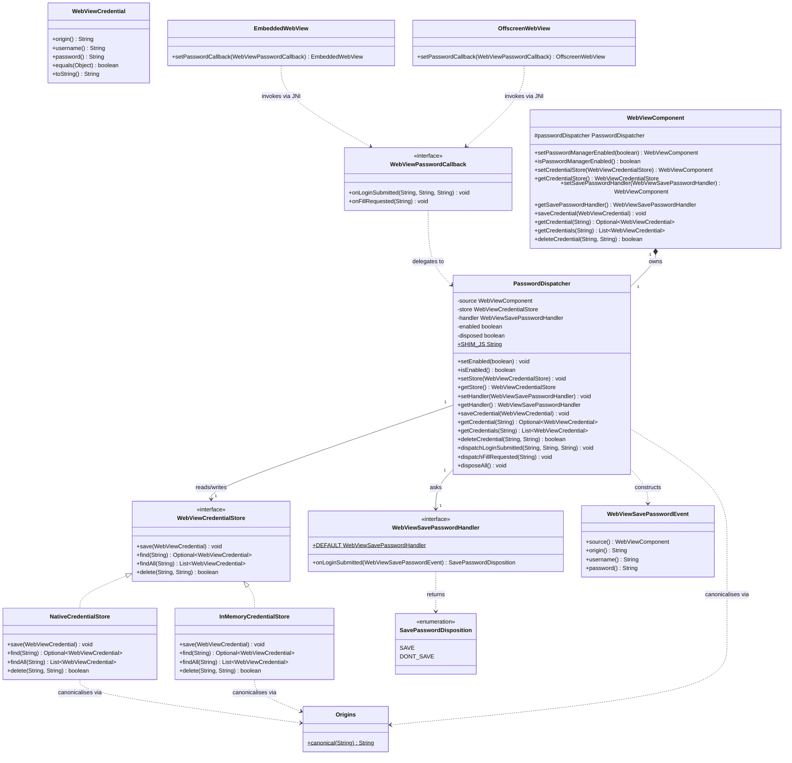

# REASONS Canvas: Built-in Password Manager (Java API + Shared Detection/Fill Script + macOS Keychain Coverage)

## R · Requirements

- Give `WebViewComponent` a browser-grade password manager: detect
  login-form submissions inside the embedded page, offer to save the
  credential via a Swing "Save password?" prompt, store it in the
  OS-native secret store, and auto-fill a stored credential into the
  matching login fields on a later page load. This canvas designs the
  full cross-platform Java contract, authors the shared detection/fill
  JavaScript once, and ships the **macOS** backend (Keychain via
  Security.framework). Linux (libsecret) and Windows (Credential
  Manager) coverage land in the two follow-up canvases (24, 25) and
  reuse this contract and this JavaScript unchanged.
- The engines this library wraps deliberately withhold this behaviour
  from embedding apps (`WKWebView` never shows Safari's private
  "Save Password" prompt), so the library provides its own. The
  concrete motivating failure: an Okta login inside `WebViewComponent`
  on macOS forces the user to retype the password every visit.
- Expose these new public types in `ca.weblite.webview`:
  - `WebViewCredential` — immutable `{origin, username, password}`
    value object; equality on `{origin, username}` (password excluded);
    `toString()` redacts the password.
  - `WebViewCredentialStore` — the storage seam interface: `save`,
    `find(origin)`, `findAll(origin)`, `delete(origin, username)`.
  - `NativeCredentialStore` — the default `WebViewCredentialStore`,
    backed by the OS-native secret store (Keychain on macOS in this
    canvas) through new process-global static JNI primitives.
  - `InMemoryCredentialStore` — a public, dependency-free
    `WebViewCredentialStore` for tests / hosts that do not want OS
    persistence.
  - `WebViewSavePasswordEvent` — immutable captured-submission event
    (`source`, `origin`, `username`, `password`); `toString()` redacts
    the password.
  - `SavePasswordDisposition` — enum `{ SAVE, DONT_SAVE }`.
  - `WebViewSavePasswordHandler` — functional interface,
    `SavePasswordDisposition onLoginSubmitted(WebViewSavePasswordEvent)`,
    invoked on the EDT; `DEFAULT` shows a Swing "Save password?" prompt
    modal to the host `JFrame`.
  - `WebViewPasswordCallback` — the JNI-facing callback interface (two
    void methods, invoked from the native message thread), analogous to
    `WebViewDialogCallback`. Application code never implements it; it
    routes through `WebViewComponent`.
- Expose these new public methods on `WebViewComponent` as concrete
  `final` methods (no abstract overload), all delegating to a
  per-component `PasswordDispatcher`:
  - `WebViewComponent setPasswordManagerEnabled(boolean)` /
    `boolean isPasswordManagerEnabled()` — master switch for the
    automatic save-prompt + autofill. **Enabled by default.** Disabling
    suppresses both automatic behaviours; the programmatic methods below
    still work.
  - `WebViewComponent setCredentialStore(WebViewCredentialStore)` /
    `WebViewCredentialStore getCredentialStore()` — the store seam;
    `null` reinstalls the default `NativeCredentialStore`;
    `get` never returns null.
  - `WebViewComponent setSavePasswordHandler(WebViewSavePasswordHandler)`
    / `WebViewSavePasswordHandler getSavePasswordHandler()` — the
    save-policy seam; `null` reinstalls the default Swing-prompt handler;
    `get` never returns null.
  - `void saveCredential(WebViewCredential)` — programmatic upsert.
  - `java.util.Optional<WebViewCredential> getCredential(String origin)`
    — programmatic lookup (most-recently-saved for the origin).
  - `java.util.List<WebViewCredential> getCredentials(String origin)` —
    all credentials for the origin, most-recently-saved first.
  - `boolean deleteCredential(String origin, String username)`.
- Author the shared detection/fill JavaScript
  (`PasswordDispatcher.SHIM_JS`), injected at document-start on every
  backend via the existing `addOnBeforeLoad` mechanism (no new injection
  plumbing). It:
  1. Locates the login form: the first `<input type="password">` and its
     associated username field (the text/email/tel input immediately
     preceding the password field within the same `<form>`; else the
     form's first such input; else, when there is no `<form>`, the
     nearest preceding such input in document order).
  2. On `submit` of a form containing a password field — and,
     best-effort, on click of a plausible submit control in a
     `<form>`-less SPA login — reads the username + password, base64url
     encodes each, and posts `S|<b64user>|<b64pass>` on the reserved
     native password channel.
  3. When the DOM is ready and a login form is present, posts `F` (fill
     request) on the same channel. Re-checks once via a bounded
     `MutationObserver` (single re-arm, disconnected after the first
     hit or after a short bounded window) for late-inserted forms.
  4. Exposes exactly one page-visible entrypoint,
     `window.__webview_pw_fill__(b64user, b64pass)`, which base64url
     decodes the two arguments, writes them into the detected username /
     password fields, and dispatches `input` then `change` events on
     each so framework-driven forms observe the change. This entrypoint
     only ever *writes* values; it never reads or returns a credential.
- The **origin is stamped natively, never trusted from JavaScript.** The
  reserved password channel is a native script-message handler whose
  implementation reads the committed frame URL from the engine at the
  instant the message arrives (`message.frameInfo` /
  `webView.URL` on macOS) and hands that URL to Java. Any origin-like
  value present in the JS payload is ignored. This prevents a page at
  one origin from saving-into or reading another origin's credential by
  posting a forged origin directly to the channel.
- All save-policy callbacks run on the Swing EDT. The dispatcher
  marshals via `SwingUtilities.invokeLater` (NON-blocking — unlike
  `DialogDispatcher`'s `invokeAndWait`), because a login submission has
  no synchronous JS contract: the form submits and navigates regardless
  of whether the credential is saved, so the native message thread must
  not be parked on a modal Swing prompt.
- All secret-store I/O (Keychain reads/writes) runs off the EDT and off
  the engine UI thread, on the dispatcher's single-thread executor. The
  autofill lookup and the post-approval save both run there.
- Add new JNI entry points on `WebViewNative`:
  - `webview_embed_set_password_callback(long, WebViewPasswordCallback)`
    and `webview_offscreen_set_password_callback(long, WebViewPasswordCallback)`
    — mirror the `..._set_dialog_callback` precedent
    (`WebViewNative.java:284, 449`). The offscreen setter is a native
    no-op stub on macOS (offscreen is itself a stub on macOS); Linux
    lightweight wires it in canvas 24.
  - Process-global static store primitives (no engine handle, because
    the OS secret store is process-global):
    - `boolean webview_cred_store_save(String service, String origin, String username, String password, long savedAtMillis)`
    - `String[] webview_cred_store_find(String service, String origin)`
      — flat triples `[username, savedAtMillis, password, ...]`,
      most-recently-saved first; empty array when none / unavailable.
    - `boolean webview_cred_store_delete(String service, String origin, String username)`
    - `boolean webview_cred_store_available()` — whether the platform
      secret store is usable (always `true` on macOS; meaningful on
      Linux in canvas 24).
    This canvas implements the macOS bodies (Keychain) and provides
    stub bodies (return `false` / empty / `false`) for the non-macOS
    compilation of `webview_embed.cpp` and for `windows/webview_embed.cc`,
    so the class links on every platform; canvases 24 / 25 fill them in.
- Add `setPasswordCallback(WebViewPasswordCallback)` to both
  `EmbeddedWebView` and `OffscreenWebView`, mirroring
  `setDialogCallback` (`EmbeddedWebView.java:566`,
  `OffscreenWebView.java:431`) — anchor the callback in the wrapper's
  `heap` `IdentityHashMap` so the JVM does not collect it while native
  holds a global ref.
- Add `-framework Security` to `build-mac.sh` (Keychain access). This is
  the only build-script change in this canvas; libsecret / Advapi32
  linkage is added by canvases 24 / 25.
- Definition of Done:
  - All 20 STORY-006-001 ACs pass on macOS with the new code.
  - A `WebViewPasswordDemo` under `demos/` exercises capture + save
    prompt + autofill in default-handler, custom-handler, and
    in-memory-store modes.
  - README grows a "Password manager" subsection documenting the
    `setPasswordManagerEnabled` / store / save-handler API, the
    origin-keying and origin-exact-match rules, the security notes
    (autofilled value is DOM-readable by page scripts; passwords live
    only in the OS store), and the macOS-only coverage caveat for this
    iteration.
  - Unit tests (`PasswordDispatcherTest`, `WebViewCredentialTest`,
    `InMemoryCredentialStoreTest`, `OriginsTest`) validate the Java
    contract headlessly (no real engine, no real Keychain): programmatic
    save/find/delete, upsert + recency ordering, origin normalisation +
    exact match, enable/disable gating, store/handler null-restores-default
    and never-null invariants, save-handler exception isolation, and
    password redaction in `toString`. Native Keychain + injection code is
    integration-tested via the demo (consistent with the
    no-automated-GUI-tests policy).
- Out of scope (explicit non-goals):
  - Linux WebKitGTK message handler + libsecret store (canvas 24).
  - Windows WebView2 message handler + Credential Manager store, and
    disabling Edge's built-in autosave (canvas 25).
  - The standalone in-process `WebView` class — this canvas only touches
    the embedded `WebViewComponent` surface.
  - A credential-management UI (a "manage saved passwords" window). Hosts
    build their own on the programmatic API.
  - Guaranteed multi-step / identifier-first (split username→password
    page) capture. Best-effort per-page capture is in scope; cross-page
    correlation is a documented limitation.
  - Passkeys / WebAuthn, TOTP/2FA, password generation, strength
    metering.
  - Cross-origin / subdomain credential matching, and login inside a
    cross-origin iframe. Matching is exact top-frame origin only.
  - Biometric / re-auth gating before autofill.
  - Guaranteed zeroisation of password material on the JVM heap (Java
    `String` immutability prevents a hard guarantee; the library
    minimises retention and never logs — documented limitation).

## E · Entities

- **WebViewCredential** (new public final class,
  `src/ca/weblite/webview/WebViewCredential.java`). Immutable value
  type. Public constructor `WebViewCredential(String origin, String
  username, String password)`. Invariants: `origin` and `username`
  non-null (NPE naming the parameter); `password` non-null (NPE);
  `origin` is stored **as supplied** (normalisation happens at the store
  boundary, not in the POJO, so a caller can construct a credential with
  any origin string and the store canonicalises it). Accessors
  `origin()`, `username()`, `password()`. `equals`/`hashCode` on
  `{origin, username}` only (password excluded). `toString()` returns
  `"WebViewCredential[origin=<...>, username=<...>, password=***]"` —
  never the password.

- **WebViewCredentialStore** (new public interface,
  `src/ca/weblite/webview/WebViewCredentialStore.java`). The storage
  seam.
  - `void save(WebViewCredential credential)` — insert or overwrite the
    credential for `{origin, username}`.
  - `java.util.Optional<WebViewCredential> find(String origin)` —
    most-recently-saved credential for the origin, or empty.
  - `java.util.List<WebViewCredential> findAll(String origin)` — all
    credentials for the origin, most-recently-saved first
    (unmodifiable list; empty when none).
  - `boolean delete(String origin, String username)` — remove one;
    returns whether anything was removed.
  No `DEFAULT` constant on the interface (the default *instance* is a
  `NativeCredentialStore`, created by the dispatcher).

- **NativeCredentialStore** (new public final class,
  `src/ca/weblite/webview/NativeCredentialStore.java`). Default store,
  backed by the OS-native secret store via the static JNI primitives.
  Owns origin canonicalisation (through `Origins`) and translates
  between `WebViewCredential` and the flat JNI triples. Stateless and
  thread-safe (the JNI primitives are process-global and serialise
  internally at the OS level). A single library-namespace `service`
  constant (`"ca.weblite.webview.passwords"`).

- **InMemoryCredentialStore** (new public final class,
  `src/ca/weblite/webview/InMemoryCredentialStore.java`). A
  `WebViewCredentialStore` backed by a `ConcurrentHashMap` keyed by
  canonical origin → ordered list of `{username, savedAtMillis,
  password}`. Applies the same canonicalisation and recency ordering as
  `NativeCredentialStore`, so tests observe identical semantics. Never
  touches the OS store. Used by tests and available to hosts.

- **WebViewSavePasswordEvent** (new public final class,
  `src/ca/weblite/webview/WebViewSavePasswordEvent.java`). Immutable.
  Package-private constructor `WebViewSavePasswordEvent(WebViewComponent
  source, String origin, String username, String password)`; `source`
  non-null (NPE), other fields non-null coerced (empty string is the
  no-value sentinel, matching the dialog POJOs). Accessors `source()`,
  `origin()`, `username()`, `password()`. `toString()` redacts the
  password.

- **SavePasswordDisposition** (new public enum,
  `src/ca/weblite/webview/SavePasswordDisposition.java`): `SAVE`,
  `DONT_SAVE`.

- **WebViewSavePasswordHandler** (new public `@FunctionalInterface`,
  `src/ca/weblite/webview/WebViewSavePasswordHandler.java`). Single
  abstract method `SavePasswordDisposition onLoginSubmitted(
  WebViewSavePasswordEvent event)`, invoked on the EDT. Public static
  constant `DEFAULT` — an instance whose `onLoginSubmitted` shows a
  Swing confirm prompt ("Save password for `<origin>`?" plus the
  username) modal to `SwingUtilities.getWindowAncestor(event.source())`,
  returning `SAVE` on OK and `DONT_SAVE` on Cancel/close. Class Javadoc
  documents EDT invocation, that the method must not block on
  `evalAsync(...).get()` (EDT hazard), and exception isolation.

- **WebViewPasswordCallback** (new public interface,
  `src/ca/weblite/webview/WebViewPasswordCallback.java`). JNI-facing;
  invoked from the native message thread. NOT `@FunctionalInterface`
  (two methods).
  - `void onLoginSubmitted(String frameUrl, String b64Username, String b64Password)`
  - `void onFillRequested(String frameUrl)`
  Class Javadoc: "Invoked from a native thread (AppKit main on macOS,
  GTK main on Linux, WebView2 worker on Windows). `frameUrl` is the
  committed URL of the frame that raised the message, read natively —
  it is the trusted origin source and must not be substituted with any
  JS-supplied value. Implementations route through `PasswordDispatcher`,
  which marshals to the EDT / a worker. Not intended for application
  code — customise via `WebViewComponent`."

- **Origins** (new package-private final utility,
  `src/ca/weblite/webview/Origins.java`). `static String canonical(String
  urlOrOrigin)`: parse via `java.net.URI`, lower-case scheme + host,
  drop the default port for the scheme (`http`→80, `https`→443, `ws`→80,
  `wss`→443), keep any non-default explicit port, and return
  `scheme + "://" + host[ + ":" + port]`. Returns `null` for opaque /
  unparseable / hostless inputs (e.g. `about:blank`, `data:` URLs) so
  callers skip them. No trailing slash, no path/query/fragment. Used by
  both stores and by the dispatcher when converting a native `frameUrl`
  to an origin key.

- **PasswordDispatcher** (new public final class,
  `src/ca/weblite/webview/PasswordDispatcher.java`). Per-component hub.
  Public-because-cross-package (matches `DialogDispatcher`). Holds the
  active store, save-handler, enabled flag; a single-thread executor for
  store I/O; the shared `SHIM_JS` constant; the native-facing dispatch
  methods; and the programmatic API the component delegates to.
  Invariants: constructed once per component, lives for its lifetime;
  `getStore()`/`getSaveHandler()` never null; `setStore(null)` /
  `setSaveHandler(null)` restore defaults; disabled ⇒ automatic dispatch
  is dropped but programmatic methods still work; disposed ⇒ automatic
  dispatch is dropped.

- **WebViewComponent** (modified;
  `src/ca/weblite/webview/swing/WebViewComponent.java`). Gains:
  - `protected final PasswordDispatcher passwordDispatcher = new PasswordDispatcher(this);`
    (same eager-construction pattern as `dialogDispatcher`).
  - the nine `final` public methods listed in R, each a thin delegation
    to `passwordDispatcher`.

- **EmbeddedWebView** / **OffscreenWebView** (modified). Each gains
  `setPasswordCallback(WebViewPasswordCallback)` mirroring
  `setDialogCallback`, anchoring the callback in `heap` and calling the
  new JNI entry point.

- **WebViewNative** (modified). Gains the two `..._set_password_callback`
  natives and the four `webview_cred_store_*` static natives.

- **`src_c/webview_embed.cpp`** (modified, macOS bodies + non-mac
  stubs). Gains: `Engine::password_callback` jobject field; a dedicated
  `WKScriptMessageHandler` registered under name `__webview_pw__` that
  reads the committed frame URL and calls the Java callback;
  `cocoa_set_password_callback`; the JNI bridge for the two callback
  setters; and the macOS Keychain bodies for the four
  `webview_cred_store_*` primitives (plus non-Apple stub bodies).

- **`windows/webview_embed.cc`** (modified, stubs only in this canvas):
  stub bodies for the four `webview_cred_store_*` primitives and the two
  `..._set_password_callback` setters, so the JNI surface links on
  Windows. Real Windows implementation is canvas 25.

- **`build-mac.sh`** (modified): add `-framework Security`.

- **WebViewPasswordDemo** (new demo,
  `demos/WebViewPasswordDemo/src/ca/weblite/webview/demos/WebViewPasswordDemo.java`).

- **README.md** (modified): "Password manager" subsection.

- **Tests** (new, under `test/ca/weblite/webview/`):
  `PasswordDispatcherTest`, `WebViewCredentialTest`,
  `InMemoryCredentialStoreTest`, `OriginsTest`.

## A · Approach

1. **Two data flows, both non-blocking:**
   - **Save (capture → prompt → store):** the injected script posts
     `S|<b64user>|<b64pass>` on the native password channel. The native
     message handler reads the committed frame URL and calls
     `WebViewPasswordCallback.onLoginSubmitted(frameUrl, b64user, b64pass)`.
     The component's callback adapter delegates to
     `passwordDispatcher.dispatchLoginSubmitted(frameUrl, b64user, b64pass)`.
     The dispatcher: drops if disposed / disabled; canonicalises
     `frameUrl` via `Origins.canonical` (drops if null); base64url-decodes
     the username/password; then `SwingUtilities.invokeLater` to build a
     `WebViewSavePasswordEvent` and call the save-handler on the EDT
     (exception-isolated). If the handler returns `SAVE`, the actual
     `store.save(...)` is submitted to the dispatcher's single-thread
     executor (off the EDT, off the engine UI thread).
   - **Autofill (request → lookup → push):** the injected script posts
     `F` when the DOM is ready with a login form. The native handler
     calls `onFillRequested(frameUrl)` → `dispatchFillRequested(frameUrl)`.
     The dispatcher: drops if disposed / disabled; canonicalises
     `frameUrl`; submits a task to its executor that calls
     `store.find(origin)`; on a hit, base64url-encodes username +
     password and calls `source.eval("window.__webview_pw_fill__('"+b64u+"','"+b64p+"')")`.
     `eval` enqueues onto the engine UI thread and returns immediately;
     the injected entrypoint writes the fields and fires `input`/`change`.

2. **Why non-blocking (`invokeLater`), not the dialog's `invokeAndWait`:**
   A login submission has no synchronous JS contract — the form submits
   and the page navigates whether or not we save. Parking the native
   message thread on a modal Swing prompt (as `DialogDispatcher` does for
   `alert`/`confirm`) would freeze the page mid-navigation and re-introduce
   the exact `invokeAndWait` deadlock hazards the dialog Safeguards warn
   about. So `PasswordDispatcher` is modelled on the non-blocking
   `WebViewMouseDispatcher` / `ConsoleDispatcher` shape: fire-and-forget
   to the EDT, and store I/O on a worker.

3. **Why the origin is native-stamped and never JS-supplied
   (security-critical):** the reserved password channel is a real
   message channel the page can post to directly, bypassing our injected
   script. If the origin were part of the JS payload, a page at
   `evil.com` could post a forged `bank.com` origin and either read
   `bank.com`'s credential (via a fill request) or poison it (via a save)
   — a cross-origin credential-theft / injection attack. `location.origin`
   read inside our script is unforgeable, but the *channel* is not, so we
   do not rely on the script's honesty. The native handler reads the
   committed frame URL (`message.frameInfo.request.URL` / `webView.URL`)
   — the browser engine's own record of which document sent the message —
   and that is the only origin Java ever uses. Any origin-like field in
   the payload is ignored. The JS payload therefore carries only the
   username/password (for save) or nothing (for fill request).

4. **Why the fill entrypoint is write-only:**
   `window.__webview_pw_fill__` is page-visible (any global function we
   install is). It only *sets* field values and dispatches events; it
   never reads or returns a credential. A malicious page calling it
   directly can only fill its own form with attacker-chosen text — a
   no-op threat. The credential only ever travels Java→page for the
   single origin-matched entry Java chose to send, so the page cannot use
   the entrypoint to extract another origin's credential.

5. **Origin canonicalisation (`Origins.canonical`):** `scheme://host`
   plus a port only when non-default for the scheme; scheme + host
   lower-cased; no path/query/fragment; `null` for opaque/hostless URLs.
   This single function is the sole definition of "origin" used by both
   stores and by the dispatcher, so `https://example.com`,
   `https://example.com:443`, and `https://EXAMPLE.com/login?x=1` all key
   to `https://example.com`, while `http://example.com` and
   `https://example.com:8443` are distinct (satisfies AC6/AC7). Programmatic
   `saveCredential`/`getCredential` inputs pass through the same function,
   so a host that stores `https://svc.example.com` and looks up
   `https://svc.example.com/` gets a hit.

6. **Recency for `find` ordering (AC11):** every stored record carries a
   `savedAtMillis` set at save time (from `System.currentTimeMillis()`),
   stored alongside the password in the secret store's value blob so it is
   uniform across all three platforms regardless of native metadata.
   `findAll` returns records sorted by `savedAtMillis` descending;
   `find` returns the first. Ties (same millis) break by username
   ascending for determinism.

7. **macOS Keychain item model (`SecItem*`):** one
   `kSecClassGenericPassword` item per `{origin, username}`:
   - `kSecAttrService` = the library namespace constant
     `"ca.weblite.webview.passwords"` (isolates from Safari's iCloud
     Keychain items).
   - `kSecAttrAccount` = `base64url(origin) + "|" + base64url(username)`
     (collision-free; the `|` separator never appears in base64url).
   - `kSecValueData` = UTF-8 of `savedAtMillis + "\n" + password`
     (millis has no newline; everything after the first newline is the
     password, so passwords may contain any character including
     newlines).
   - `kSecAttrSynchronizable = kCFBooleanFalse` (local item; do not push
     the library's own items into iCloud Keychain sync).
   - **save** = query exact account; `SecItemUpdate` the value if present
     else `SecItemAdd`.
   - **find** = query `service` + `kSecMatchLimitAll` +
     `kSecReturnAttributes` + `kSecReturnData`, filter accounts whose
     decoded origin equals the target, decode username/millis/password,
     return flat triples sorted by millis desc.
   - **delete** = `SecItemDelete` with exact account.
   All four run on the caller's thread (the dispatcher's executor for
   automatic paths; the caller's thread for the programmatic API — a
   Keychain call is a fast local IPC, acceptable to run synchronously on
   the programmatic path so `saveCredential` then `getCredential`
   round-trips deterministically, per AC8).

8. **macOS injection + capture wiring:** the shared `SHIM_JS` is injected
   as a document-start user script via the existing `addOnBeforeLoad`
   path (`cocoa_init_script` → `WKUserScript` at document-start). A
   dedicated `WKScriptMessageHandler` is registered on the existing
   `e->manager` (`WKUserContentController`) under name `__webview_pw__`;
   its `didReceiveScriptMessage:` reads `message.body` (an `NSString`),
   reads the committed frame URL from `message.frameInfo.request.URL`
   (fallback `message.webView.URL`), parses the leading tag (`S`/`F`),
   and invokes the Java callback. Registration and teardown mirror the
   existing `"external"` handler (`addScriptMessageHandler:name:` at
   engine create; `removeScriptMessageHandlerForName:` at destroy).

9. **JNI mechanics** copy the `fire_dialog_*` helpers verbatim in shape:
   defensive `GetEnv`/`AttachCurrentThreadAsDaemon` with symmetric
   detach; per-call `GetObjectClass` + `GetMethodID`; `Call*Method`; then
   mandatory `ExceptionCheck` → `ExceptionDescribe` → `ExceptionClear`.
   `Engine::password_callback` is a global ref created in
   `cocoa_set_password_callback` (deleting any prior ref) and deleted in
   the engine destructor.

10. **No JSON parser** (the project has none). The JS→native payload is
    the pipe-tagged string `S|<b64user>|<b64pass>` or `F`; the native
    handler splits on the first two `|` and passes the base64url
    substrings through to Java unchanged. Java (not native) base64url
    decodes, so native stays free of base64 code. The Java→JS fill call
    passes base64url strings that JS `atob`-decodes (after url→standard
    fixup).

11. **Enable/disable and injection:** `SHIM_JS` is injected
    unconditionally (once, via `addOnBeforeLoad`, replayed per document).
    The enabled flag is enforced entirely in `PasswordDispatcher`:
    when disabled, `dispatchLoginSubmitted` / `dispatchFillRequested`
    return immediately (no prompt, no lookup, no fill), while the
    programmatic methods ignore the flag. Toggling at runtime therefore
    takes effect on the next submit / next page load with no re-injection.

12. **Store swap / handler swap** read the `volatile` fields per
    dispatch, exactly like `DialogDispatcher`'s handler field, so a
    mid-session `setCredentialStore(...)` affects the next operation.

13. **Demo strategy:** `WebViewPasswordDemo` loads an inline login page
    (username + password + submit) via `addOnBeforeLoad` + `setUrl`. A
    `JComboBox` switches store mode (Native Keychain / in-memory) and a
    checkbox toggles `setPasswordManagerEnabled`. The demo prints capture
    events (with the password redacted) and provides buttons for
    programmatic `saveCredential` / `getCredential` / `deleteCredential`
    so AC8–AC12 are demonstrable interactively. It sets
    `JPopupMenu.setDefaultLightWeightPopupEnabled(false)` and the tooltip
    equivalent at startup (heavyweight popup prerequisite).

## S · Structure

### Inheritance Relationships
1. `WebViewCredentialStore` is a public interface; `NativeCredentialStore`
   and `InMemoryCredentialStore` are public final classes implementing it.
2. `WebViewSavePasswordHandler` is a public `@FunctionalInterface` with a
   single abstract method and a `DEFAULT` static constant.
3. `WebViewPasswordCallback` is a public interface (two methods; NOT
   `@FunctionalInterface`).
4. `WebViewCredential`, `WebViewSavePasswordEvent` are public final
   value classes (no inheritance), matching the `ConsoleMessage` /
   `WebViewAlertEvent` POJO house style.
5. `SavePasswordDisposition` is a public enum.
6. `Origins` is a package-private final utility (private constructor).
7. `PasswordDispatcher` is a public final class (matches
   `DialogDispatcher`).
8. `WebViewComponent` (existing abstract class) gains a
   `PasswordDispatcher` field and nine `final` methods; no change to its
   abstract surface, both subclasses inherit the methods.
9. `EmbeddedWebView` / `OffscreenWebView` (existing concrete classes)
   each gain one `setPasswordCallback` method.

### Dependencies
1. `WebViewSavePasswordHandler.DEFAULT` → `javax.swing.JOptionPane`,
   `javax.swing.SwingUtilities.getWindowAncestor`, `java.awt.Window`.
2. `PasswordDispatcher` → `WebViewCredentialStore`,
   `WebViewSavePasswordHandler`, `WebViewSavePasswordEvent`, `Origins`,
   `javax.swing.SwingUtilities`, `java.util.Base64`,
   `java.util.concurrent.Executors` (single-thread executor),
   `WebViewComponent` (for `eval` on the fill path).
3. `NativeCredentialStore` / `InMemoryCredentialStore` → `Origins`,
   `WebViewCredential`, `java.util.Base64`; `NativeCredentialStore` →
   `WebViewNative.webview_cred_store_*`.
4. `WebViewComponent` → `PasswordDispatcher` and the public password
   types.
5. `WebViewHeavyweightComponent.createPeer()` → `EmbeddedWebView`,
   `PasswordDispatcher`, `WebViewPasswordCallback`. Injects
   `PasswordDispatcher.SHIM_JS` via `embedded.addOnBeforeLoad(...)` and
   installs a `WebViewPasswordCallback` adapter delegating to
   `passwordDispatcher.dispatch*`.
6. `WebViewLightweightComponent.addNotify()` → same shape via
   `OffscreenWebView` (native no-op on macOS; live on Linux in canvas 24).
7. `EmbeddedWebView.setPasswordCallback` →
   `WebViewNative.webview_embed_set_password_callback`;
   `OffscreenWebView.setPasswordCallback` →
   `WebViewNative.webview_offscreen_set_password_callback`.
8. `NativeCredentialStore` → the four static `webview_cred_store_*`
   natives → macOS Keychain (`SecItem*`) in `webview_embed.cpp`.
9. macOS `__webview_pw__` message handler → `Engine::password_callback`
   → JNI `CallVoidMethod` → `WebViewPasswordCallback.on*` →
   `PasswordDispatcher.dispatch*` → EDT (prompt) / executor (store) /
   `eval` (fill).

### Layered Architecture
1. **Native engine layer** (`src_c/webview_embed.cpp`): the
   `__webview_pw__` `WKScriptMessageHandler`, `cocoa_set_password_callback`,
   the callback-setter JNI bridges, and the macOS Keychain bodies of the
   four store primitives (plus non-Apple stubs). Engine struct gains
   `password_callback`.
2. **JNI surface** (`WebViewNative`): two callback-setter natives + four
   static store natives.
3. **Engine wrapper layer** (`EmbeddedWebView` / `OffscreenWebView`):
   `setPasswordCallback` anchoring in `heap`.
4. **Store layer** (`NativeCredentialStore`, `InMemoryCredentialStore`,
   `Origins`): the `WebViewCredentialStore` implementations + origin
   canonicalisation.
5. **Dispatcher layer** (`PasswordDispatcher`): per-component hub;
   enabled flag; EDT marshaling (non-blocking); worker executor for store
   I/O; the shared `SHIM_JS`; programmatic API.
6. **Component API layer** (`WebViewComponent`): the nine `final`
   password methods; owns the dispatcher.
7. **Public contract layer** (`WebViewCredential`,
   `WebViewCredentialStore`, `WebViewSavePasswordHandler`,
   `WebViewSavePasswordEvent`, `SavePasswordDisposition`,
   `WebViewPasswordCallback`).
8. **Wiring layer** (`WebViewHeavyweightComponent.createPeer()`,
   `WebViewLightweightComponent.addNotify()`): inject `SHIM_JS`, install
   the callback bridge.
9. **Demo layer** (`demos/WebViewPasswordDemo/`).

## O · Operations

### 1. Create Utility — Origins
File: `src/ca/weblite/webview/Origins.java`

1. Responsibility: the single definition of "origin" (scheme+host+port,
   default port dropped) used everywhere in the feature.
2. Package-private final class, private constructor.
3. `static String canonical(String urlOrOrigin)`:
   - Logic: if input null/blank → return null. Parse with `new
     java.net.URI(input.trim())`. Get `scheme` and `host`; if either
     null/empty → return null (opaque/hostless, e.g. `about:blank`,
     `data:`). Lower-case scheme and host. Determine port: `uri.getPort()`
     (`-1` when absent). Compute the default port for the scheme
     (`http`/`ws`→80, `https`/`wss`→443, else -1). If port == -1 or port
     == default → omit; else append `":" + port`. Return
     `scheme + "://" + host` (+ optional port). Catch
     `URISyntaxException` → return null.
4. `static String defaultPort(String scheme)` (private helper) as above.
5. No logging.

### 2. Create Value Object — WebViewCredential
File: `src/ca/weblite/webview/WebViewCredential.java`

1. Responsibility: immutable `{origin, username, password}` carrier.
2. Public constructor `WebViewCredential(String origin, String username,
   String password)`: null-check all three (NPE naming the parameter);
   store in `final` ivars verbatim (no normalisation here).
3. Accessors `origin()`, `username()`, `password()` (no-`get` style).
4. `equals(Object)` / `hashCode()` on `origin` + `username` only
   (password excluded, so a re-saved password is "equal" for
   set/dedup purposes).
5. `toString()` → `"WebViewCredential[origin=" + origin + ", username="
   + username + ", password=***]"`. Never emit the password.

### 3. Create Value Object — WebViewSavePasswordEvent
File: `src/ca/weblite/webview/WebViewSavePasswordEvent.java`

1. Responsibility: immutable captured-submission event handed to the
   save-handler.
2. Package-private constructor `(WebViewComponent source, String origin,
   String username, String password)`: null-check `source` (NPE
   `"source"`); coerce null `origin`/`username`/`password` to empty.
3. Accessors `source()`, `origin()`, `username()`, `password()`.
4. `toString()` redacts the password (as Operation 2).

### 4. Create Enum — SavePasswordDisposition
File: `src/ca/weblite/webview/SavePasswordDisposition.java`

1. Public enum with constants `SAVE`, `DONT_SAVE`. Javadoc: the
   save-handler's decision.

### 5. Create Handler Interface — WebViewSavePasswordHandler
File: `src/ca/weblite/webview/WebViewSavePasswordHandler.java`

1. Public `@FunctionalInterface`.
2. `SavePasswordDisposition onLoginSubmitted(WebViewSavePasswordEvent event)`
   — invoked on the EDT.
3. Public static constant `DEFAULT`:
   - `WebViewSavePasswordHandler DEFAULT = event -> { ... }`.
   - Logic: `Window host = SwingUtilities.getWindowAncestor(event.source());`
     `String msg = "Save the password for " + event.origin() + "?\n\nUsername: " + event.username();`
     `int r = JOptionPane.showConfirmDialog(host, msg, "Save password?", JOptionPane.OK_CANCEL_OPTION, JOptionPane.QUESTION_MESSAGE);`
     `return r == JOptionPane.OK_OPTION ? SavePasswordDisposition.SAVE : SavePasswordDisposition.DONT_SAVE;`.
   - Never include the password in the dialog text.
4. Class Javadoc: EDT invocation; must return promptly and must not block
   on `evalAsync(...).get()`; exceptions are caught by the dispatcher and
   forwarded to the default uncaught-exception handler; a caller that
   wants no UI overrides this to return a disposition directly; macOS
   coverage this iteration (forward-ref canvases 24/25 for Linux/Windows).

### 6. Create Store Interface — WebViewCredentialStore
File: `src/ca/weblite/webview/WebViewCredentialStore.java`

1. Public interface with the four methods from E. Method Javadoc: `save`
   is upsert on `{origin, username}`; `find` returns the
   most-recently-saved for the origin; `findAll` is most-recent-first and
   unmodifiable; `delete` returns whether a record was removed. Implementations
   must be safe to call from any thread and should not throw on a missing
   backend (return empty / false).

### 7. Create Store — NativeCredentialStore
File: `src/ca/weblite/webview/NativeCredentialStore.java`

1. Responsibility: default OS-backed store via the static JNI primitives.
2. Public final class; `static final String SERVICE = "ca.weblite.webview.passwords";`.
3. `save(WebViewCredential c)`:
   - `String origin = Origins.canonical(c.origin());` if null → return
     (nothing to key on).
   - `WebViewNative.webview_cred_store_save(SERVICE, origin, c.username(), c.password(), System.currentTimeMillis());`
     Wrap in try/catch(Throwable) → swallow (graceful; e.g. store
     unavailable). Never log the password.
4. `find(String origin)`: `return findAll(origin).stream().findFirst();`.
5. `findAll(String origin)`:
   - `String o = Origins.canonical(origin);` if null → return empty list.
   - `String[] flat = WebViewNative.webview_cred_store_find(SERVICE, o);`
     (try/catch → empty). Iterate in triples `[username, millisStr,
     password]`; build `WebViewCredential(o, username, password)` (the
     canonical origin); collect with their `millis`. Sort by millis desc,
     then username asc. Return `Collections.unmodifiableList`.
   - Native already returns most-recent-first, but Java re-sorts so the
     ordering contract holds identically across all three platforms.
6. `delete(String origin, String username)`:
   - canonicalise; if null → false; else
     `return WebViewNative.webview_cred_store_delete(SERVICE, o, username);`
     (try/catch → false).
7. No password in any log / `toString`.

### 8. Create Store — InMemoryCredentialStore
File: `src/ca/weblite/webview/InMemoryCredentialStore.java`

1. Responsibility: OS-free store with identical semantics, for tests /
   hosts.
2. Public final class. Backing: `ConcurrentHashMap<String,
   List<Rec>>` keyed by canonical origin, where `Rec` is a private static
   `{username, savedAtMillis, password}`. All mutations synchronised on
   the per-origin list.
3. `save`: canonicalise origin (null → return); remove any existing rec
   with equal username; add `{username, now, password}`.
4. `findAll`: canonicalise; copy the list; sort millis desc then username
   asc; map to `WebViewCredential(origin, username, password)`;
   unmodifiable.
5. `find`: first of `findAll`.
6. `delete`: canonicalise; remove rec by username; return whether
   removed.

### 9. Create JNI Callback Interface — WebViewPasswordCallback
File: `src/ca/weblite/webview/WebViewPasswordCallback.java`

1. Public interface, two `void` methods:
   `onLoginSubmitted(String frameUrl, String b64Username, String b64Password)`,
   `onFillRequested(String frameUrl)`.
2. Class Javadoc as in E (native thread; `frameUrl` is the trusted
   native-stamped origin source; not for application code).

### 10. Create Dispatcher — PasswordDispatcher
File: `src/ca/weblite/webview/PasswordDispatcher.java`

1. Responsibility: per-component hub — holds store / handler / enabled;
   receives native captures + fill requests; runs the save prompt on the
   EDT (non-blocking); runs store I/O on a worker; pushes autofill via
   `eval`; exposes the programmatic API; owns `SHIM_JS`.
2. Public final class.
3. Fields:
   - `private final WebViewComponent source;`
   - `private volatile WebViewCredentialStore store = new NativeCredentialStore();`
   - `private volatile WebViewSavePasswordHandler handler = WebViewSavePasswordHandler.DEFAULT;`
   - `private volatile boolean enabled = true;`
   - `private volatile boolean disposed = false;`
   - `private final java.util.concurrent.ExecutorService io = Executors.newSingleThreadExecutor(r -> { Thread t = new Thread(r, "webview-password-io"); t.setDaemon(true); return t; });`
4. Constructor `(WebViewComponent source)`: null-check; store.
5. Setters/getters:
   - `setEnabled(boolean)`, `isEnabled()`.
   - `setStore(WebViewCredentialStore s)`: `store = (s == null) ? new NativeCredentialStore() : s;`.
   - `getStore()` (never null).
   - `setHandler(WebViewSavePasswordHandler h)`: `handler = (h == null) ? WebViewSavePasswordHandler.DEFAULT : h;`.
   - `getHandler()` (never null).
6. Programmatic API (run synchronously on the caller thread so
   round-trips are deterministic — AC8/AC9/AC10/AC11):
   - `saveCredential(WebViewCredential c)`: null-check; `store.save(c)`.
   - `getCredential(String origin)`: `return store.find(origin);`.
   - `getCredentials(String origin)`: `return store.findAll(origin);`.
   - `deleteCredential(String origin, String username)`: `return store.delete(origin, username);`.
7. Native-facing dispatch:
   - `dispatchLoginSubmitted(String frameUrl, String b64User, String b64Pass)`:
     - if `disposed || !enabled` → return.
     - `String origin = Origins.canonical(frameUrl);` if null → return.
     - decode `user`/`pass` via `base64UrlDecode` (private helper; on
       `IllegalArgumentException` → return).
     - `SwingUtilities.invokeLater(() -> runPrompt(origin, user, pass));`
   - `private void runPrompt(String origin, String user, String pass)`
     (on EDT):
     - re-check `disposed || !enabled` → return.
     - `WebViewSavePasswordEvent ev = new WebViewSavePasswordEvent(source, origin, user, pass);`
     - `SavePasswordDisposition d;` `try { d = handler.onLoginSubmitted(ev); } catch (Throwable t) { forward(t); return; }`
     - if `d == SavePasswordDisposition.SAVE` → `io.execute(() -> safeSave(new WebViewCredential(origin, user, pass)));`
   - `dispatchFillRequested(String frameUrl)`:
     - if `disposed || !enabled` → return.
     - `String origin = Origins.canonical(frameUrl);` if null → return.
     - `io.execute(() -> doFill(origin));`
   - `private void doFill(String origin)` (on io thread):
     - `Optional<WebViewCredential> c;` `try { c = store.find(origin); } catch (Throwable t) { forward(t); return; }`
     - if absent → return (AC19).
     - `String js = "window.__webview_pw_fill__('" + base64UrlEncode(c.username()) + "','" + base64UrlEncode(c.password()) + "')";`
     - `try { source.eval(js); } catch (Throwable t) { forward(t); }` — never log `js` (it embeds the password).
   - `private void safeSave(WebViewCredential c)`: `try { store.save(c); } catch (Throwable t) { forward(t); }`.
8. `disposeAll()`: `disposed = true; io.shutdownNow();` (idempotent).
9. Private helpers: `base64UrlEncode(String)` /
   `base64UrlDecode(String)` (UTF-8 ⇄ `Base64.getUrlEncoder().withoutPadding()`
   / `Base64.getUrlDecoder()`); `forward(Throwable t)` →
   `Thread.getDefaultUncaughtExceptionHandler().uncaughtException(Thread.currentThread(), t)`
   guarded for a null handler.
10. `public static final String SHIM_JS = "..."` — see Operation 11.

### 11. Author the Shared Detection/Fill Script — PasswordDispatcher.SHIM_JS
File: `src/ca/weblite/webview/PasswordDispatcher.java` (string constant)

1. An IIFE, guarded so it installs at most once per document
   (`if (window.__webview_pw_installed__) return; window.__webview_pw_installed__ = true;`).
2. `post(payload)` helper — sends to the native `__webview_pw__` channel,
   branching per engine (all branches present so the one string works on
   every backend; only the matching one exists at runtime):
   - WebKit (macOS/Linux): `if (window.webkit && window.webkit.messageHandlers && window.webkit.messageHandlers.__webview_pw__) window.webkit.messageHandlers.__webview_pw__.postMessage(payload);`
   - WebView2 (Windows): `else if (window.chrome && window.chrome.webview) window.chrome.webview.postMessage('__webview_pw__:' + payload);`
3. base64url encode/decode helpers in JS (`b64e`/`b64d`) over UTF-8
   (`encodeURIComponent`/`unescape` or `TextEncoder`), url-alphabet,
   padding-tolerant to match Java's `Base64.getUrlDecoder`.
4. `findFields()` → `{user, pass}` or null:
   - `pass` = first `input[type=password]` in the document.
   - if none → return null (a page with no password field never triggers
     save/fill — Safeguard for the "search form must not prompt" rule).
   - `user` = within `pass.form` if present: the text/email/tel input
     immediately preceding `pass` in the form's controls, else the form's
     first text/email/tel input; if no form: the nearest preceding
     text/email/tel input in document order. May be null (password-only
     forms) — then username is treated as empty string.
5. Save capture:
   - Attach a capturing `submit` listener on `document` that, when the
     submitted form contains the password field, reads `user?.value ?? ''`
     and `pass.value`, and if `pass.value` is non-empty calls
     `post('S|' + b64e(user) + '|' + b64e(passVal))`.
   - Best-effort SPA: a capturing `click` listener on `document` for
     `button, input[type=submit], [role=button]` that, if a password
     field currently has a non-empty value and there is no enclosing
     `<form>`, posts the same `S|...`. Debounce so a submit + click do
     not double-post within a short window.
6. Fill request:
   - On `DOMContentLoaded` (or immediately if already interactive), if
     `findFields()` is non-null, call `post('F')`.
   - Arm a `MutationObserver` on `document.documentElement`
     (`childList+subtree`) that, on the first later appearance of a
     password field (when none existed at ready time), posts `F` once,
     then disconnects. Also disconnect after a bounded timeout
     (e.g. 10s) so it never observes indefinitely.
7. Fill entrypoint:
   - `window.__webview_pw_fill__ = function(b64u, b64p) { var f = findFields(); if (!f) return; if (f.user && b64u) setVal(f.user, b64d(b64u)); if (f.pass) setVal(f.pass, b64d(b64p)); };`
   - `setVal(el, v)` sets `el.value = v` via the native value setter
     (`Object.getOwnPropertyDescriptor(HTMLInputElement.prototype,'value').set.call(el, v)`)
     then dispatches `new Event('input',{bubbles:true})` and
     `new Event('change',{bubbles:true})` so React/Vue-style controlled
     inputs observe the change (AC5).
8. Wrap everything in `try/catch` so a page that has frozen prototypes
   or unusual DOM never throws out of the injected script.

### 12. Extend WebViewComponent Base
File: `src/ca/weblite/webview/swing/WebViewComponent.java`

1. Add field (next to `dialogDispatcher`):
   `protected final PasswordDispatcher passwordDispatcher = new PasswordDispatcher(this);`.
2. Add nine `final` methods, each delegating:
   - `setPasswordManagerEnabled(boolean e)` → `passwordDispatcher.setEnabled(e); return this;`
   - `isPasswordManagerEnabled()` → `passwordDispatcher.isEnabled();`
   - `setCredentialStore(WebViewCredentialStore s)` → `passwordDispatcher.setStore(s); return this;`
   - `getCredentialStore()` → `passwordDispatcher.getStore();`
   - `setSavePasswordHandler(WebViewSavePasswordHandler h)` → `passwordDispatcher.setHandler(h); return this;`
   - `getSavePasswordHandler()` → `passwordDispatcher.getHandler();`
   - `saveCredential(WebViewCredential c)` → `passwordDispatcher.saveCredential(c);`
   - `getCredential(String origin)` → `passwordDispatcher.getCredential(origin);`
   - `getCredentials(String origin)` → `passwordDispatcher.getCredentials(origin);`
   - `deleteCredential(String origin, String u)` → `passwordDispatcher.deleteCredential(origin, u);`
3. In the existing `dispose()` path, call `passwordDispatcher.disposeAll()`
   alongside the existing `dialogDispatcher.disposeAll()` (both swing
   subclasses' dispose already funnels through the base or calls the
   dispatchers — mirror whatever the dialog dispatcher does).
4. Javadoc on each method: the manager is enabled by default; origin is
   canonical scheme+host+port; autofill is exact-origin; passwords go to
   the OS store; macOS coverage this iteration.

### 13. Extend EmbeddedWebView with setPasswordCallback
File: `src/ca/weblite/webview/EmbeddedWebView.java`

1. `public EmbeddedWebView setPasswordCallback(WebViewPasswordCallback cb)`
   mirroring `setDialogCallback` (line 566): anchor `cb` in `heap`
   (the `IdentityHashMap` that keeps callbacks alive against the native
   global ref), then call
   `WebViewNative.webview_embed_set_password_callback(peer, cb);`. Return
   `this`.

### 14. Extend OffscreenWebView with setPasswordCallback
File: `src/ca/weblite/webview/OffscreenWebView.java`

1. `public OffscreenWebView setPasswordCallback(WebViewPasswordCallback cb)`
   mirroring `OffscreenWebView.setDialogCallback` (line 431): anchor in
   `heap`, call `WebViewNative.webview_offscreen_set_password_callback(peer, cb);`.

### 15. Extend WebViewNative with the new natives
File: `src/ca/weblite/webview/WebViewNative.java`

1. Add two callback-setter declarations (after the dialog ones):
   - `native static void webview_embed_set_password_callback(long w, WebViewPasswordCallback cb);`
   - `native static void webview_offscreen_set_password_callback(long peer, WebViewPasswordCallback cb);`
2. Add four static store declarations:
   - `native static boolean webview_cred_store_save(String service, String origin, String username, String password, long savedAtMillis);`
   - `native static String[] webview_cred_store_find(String service, String origin);`
   - `native static boolean webview_cred_store_delete(String service, String origin, String username);`
   - `native static boolean webview_cred_store_available();`
3. Class-level note that headers are javah-optional; the mangled
   `JNIEXPORT` functions are implemented directly in the native files.

### 16. Implement macOS native — password channel + Keychain store
File: `src_c/webview_embed.cpp` (guarded `#if defined(WEBVIEW_COCOA)`)

1. `Engine` struct: add `jobject password_callback = nullptr;` alongside
   `dialog_callback`.
2. `cocoa_set_password_callback(Engine* e, JNIEnv* env, jobject cb)`:
   delete any prior global ref; `e->password_callback = cb ? env->NewGlobalRef(cb) : nullptr;`
   (mirrors `cocoa_set_dialog_callback`).
3. Register the message handler: where `"external"` is registered on
   `e->manager` (~`:5117`), also
   `addScriptMessageHandler:name:@"__webview_pw__"` on the same
   controller, using a handler class that implements
   `WKScriptMessageHandler`. In `userContentController:didReceiveScriptMessage:`:
   - `id body = msg.body;` → `NSString`. If not a string → return.
   - Read the committed frame URL: `id frameInfo = [msg frameInfo]; id req = [frameInfo request]; id url = [req URL]; NSString* frameUrl = [url absoluteString];` with a fallback to `[[msg webView] URL] absoluteString]` when nil. (KVC/`@try` guard where a selector may be nil on older SDKs.)
   - Parse the tag: first char `'S'` → split the remainder on `'|'` into
     `b64user`, `b64pass`; call `fire_password_submitted(e, frameUrl, b64user, b64pass)`. First char `'F'` → `fire_password_fill_requested(e, frameUrl)`.
4. `fire_password_submitted` / `fire_password_fill_requested`: copy the
   `fire_dialog_*` mechanics — defensive attach, `GetObjectClass` +
   `GetMethodID("onLoginSubmitted","(Ljava/lang/String;Ljava/lang/String;Ljava/lang/String;)V")`
   / `("onFillRequested","(Ljava/lang/String;)V")`, `CallVoidMethod`,
   `ExceptionCheck/Describe/Clear`, symmetric detach. No-op if
   `password_callback` is null.
5. Teardown: in the destroy path, `removeScriptMessageHandlerForName:@"__webview_pw__"`
   before releasing, and `DeleteGlobalRef(password_callback)`.
6. JNI bridges (mangled names) for
   `webview_embed_set_password_callback` (→ `cocoa_set_password_callback`)
   and `webview_offscreen_set_password_callback` (no-op stub on macOS).
7. Keychain store — implement the four primitives (compiled on Apple):
   - Helper `account = b64url(origin) + "|" + b64url(username)` and its
     inverse; `service` = the jstring arg.
   - `webview_cred_store_save`: build a query dict
     (`kSecClass=kSecClassGenericPassword`, `kSecAttrService`,
     `kSecAttrAccount`); `SecItemCopyMatching` to test existence; value =
     UTF-8 of `millis + "\n" + password`; if present `SecItemUpdate`
     (set `kSecValueData`), else `SecItemAdd` (add `kSecValueData` +
     `kSecAttrSynchronizable=kCFBooleanFalse`). Return `errSecSuccess`.
   - `webview_cred_store_find`: query `service` + `kSecMatchLimitAll` +
     `kSecReturnAttributes=true` + `kSecReturnData=true`; iterate the
     result array; for each item decode `kSecAttrAccount` → origin,
     username; if origin == target, split `kSecValueData` on first `\n`
     into millis + password; collect `[username, millis, password]`.
     Return a `jobjectArray` of the flat triples (Java sorts). Empty
     array on `errSecItemNotFound`.
   - `webview_cred_store_delete`: `SecItemDelete` with exact account;
     return `errSecSuccess || errSecItemNotFound ? (removed?)` — return
     `true` only when an item was actually deleted (`errSecSuccess`).
   - `webview_cred_store_available`: return `true`.
   - All string↔`CFString` conversions via `CFStringCreateWithCString`
     UTF-8; release every created CF object; no NSLog of passwords.
8. Non-Apple compilation of this file (`#else`): stub bodies for the four
   store primitives (`false` / empty `jobjectArray` / `false`) and the
   two setters, so the Linux build of `webview_embed.cpp` links until
   canvas 24 replaces them.

### 17. Windows native stubs
File: `windows/webview_embed.cc`

1. Add stub `JNIEXPORT` bodies for `webview_embed_set_password_callback`,
   `webview_offscreen_set_password_callback`, and the four
   `webview_cred_store_*` primitives (`false` / empty / `false`) so the
   Windows binary links. Real implementation is canvas 25.

### 18. Wire the bridge — WebViewHeavyweightComponent
File: `src/ca/weblite/webview/swing/WebViewHeavyweightComponent.java`

1. In `createPeer()`, alongside the existing console / dialog installs
   (after `embedded.setDialogCallback(...)`, ~`:613`):
   - `embedded.addOnBeforeLoad(PasswordDispatcher.SHIM_JS);`
   - `embedded.setPasswordCallback(new WebViewPasswordCallback() {
        public void onLoginSubmitted(String u, String user, String pass) { passwordDispatcher.dispatchLoginSubmitted(u, user, pass); }
        public void onFillRequested(String u) { passwordDispatcher.dispatchFillRequested(u); }
     });`
   - (first param name `u` = the native-stamped frameUrl.)

### 19. Wire the bridge — WebViewLightweightComponent
File: `src/ca/weblite/webview/swing/WebViewLightweightComponent.java`

1. In `addNotify()`, in the `engine != null` branch, after the existing
   dialog install (~`:290`):
   - `engine.addOnBeforeLoad(PasswordDispatcher.SHIM_JS);`
   - `engine.setPasswordCallback(...)` delegating to `passwordDispatcher`
     as in Operation 18.
2. On macOS the offscreen native setter is a no-op, so this compiles and
   runs harmlessly; it goes live on Linux in canvas 24.

### 20. Build script — link Security.framework
File: `build-mac.sh`

1. Add `-framework Security` to the `c++ ... -framework WebKit -framework
   Cocoa -framework QuartzCore` line.

### 21. Create Demo — WebViewPasswordDemo
File: `demos/WebViewPasswordDemo/src/ca/weblite/webview/demos/WebViewPasswordDemo.java`

1. Startup: `JPopupMenu.setDefaultLightWeightPopupEnabled(false);` and
   `ToolTipManager.sharedInstance().setLightWeightPopupEnabled(false);`.
2. Build a `WebViewComponent.create()`, load an inline login page
   (`addOnBeforeLoad` a `document.write`-style page or `setUrl` a
   `data:`/`about:blank`+injected form) with a username input, a
   `<input type=password>`, and a submit button, at a stable http(s)-ish
   origin (use a small local `data:` or file page; document that the
   demo's "origin" is whatever the page loads as).
3. Controls: a store-mode `JComboBox` (`Native Keychain` /
   `In-memory`) calling `setCredentialStore(...)`; an "Enabled"
   `JCheckBox` calling `setPasswordManagerEnabled(...)`; buttons
   `Save (programmatic)`, `Get`, `Delete` that call the programmatic API
   for a fixed origin; a log pane that prints capture events and results
   with passwords redacted.
4. Comment at top: exercises AC1–AC14 interactively; passwords are never
   printed.

### 22. Update README
File: `README.md`

1. New "Password manager" subsection (sibling of "Browser-initiated
   dialogs"): the `setPasswordManagerEnabled` default-on switch; the
   store + save-handler seams; origin = scheme+host+port and exact-origin
   autofill; that credentials live only in the OS store (Keychain on
   macOS this iteration; libsecret / Credential Manager to follow); the
   security note that an autofilled value is readable by page scripts
   (browser-parity) and that the library never logs or files passwords;
   the macOS-only coverage caveat with a forward reference to the Linux /
   Windows canvases.
2. List `WebViewPasswordDemo` under the demos paragraph.

### 23. Unit Tests
Files under `test/ca/weblite/webview/`:

1. `OriginsTest`: canonicalises `https://example.com`,
   `https://example.com:443`, `https://EXAMPLE.com/login?x=1` all to
   `https://example.com`; keeps `:8443`; distinguishes `http` from
   `https`; returns null for `about:blank` / `data:...` / `""` / null.
2. `WebViewCredentialTest`: accessors; NPEs on null args; equality on
   `{origin, username}` ignoring password; `toString` omits the password.
3. `InMemoryCredentialStoreTest`: save→find; upsert (Operation-10
   overwrite, single record); multiple usernames retained + `find`
   returns most-recent (AC11); delete; origin canonicalisation applied on
   both save and query.
4. `PasswordDispatcherTest` (no engine, no Keychain — inject an
   `InMemoryCredentialStore` and a recording handler):
   - `dispatchLoginSubmitted` with a `SAVE` handler stores the decoded
     credential under the canonical origin (feed a base64url payload).
   - `DONT_SAVE` stores nothing.
   - disabled ⇒ neither prompt nor store touched; programmatic
     `saveCredential`/`getCredential` still work (AC12).
   - handler runs on the EDT (record `SwingUtilities.isEventDispatchThread()`).
   - handler throwing does not propagate and stores nothing (AC20).
   - `setStore(null)` / `setHandler(null)` restore non-null defaults
     (AC16/AC17); getters never null.
   - `dispatchFillRequested` with a stored credential invokes
     `source.eval(...)` with a `__webview_pw_fill__` call carrying the
     base64url username/password (use a `WebViewComponent` test double /
     spy capturing the eval string; assert the raw password is NOT the
     literal in the string — it is base64url-encoded); with no stored
     credential, `eval` is never called (AC19).
   - password never appears in `WebViewCredential.toString()` /
     `WebViewSavePasswordEvent.toString()` (AC18).

## N · Norms

- **Model `PasswordDispatcher` on the NON-blocking dispatchers.** Follow
  `WebViewMouseDispatcher` / `ConsoleDispatcher` (`invokeLater`,
  fan-out), NOT `DialogDispatcher` (`invokeAndWait`). Document the
  divergence in the class Javadoc: the save prompt must never park the
  native message thread.
- **Origin is always canonicalised through `Origins.canonical`, and is
  only ever taken from the native `frameUrl`.** No code path may accept an
  origin from a JS payload. Every store call canonicalises its origin
  argument (both automatic and programmatic paths) so equal origins
  collapse identically everywhere.
- **Accessor naming** uses the no-`get` style (`credential.origin()`,
  `event.username()`), matching `ConsoleMessage` / `WebViewAlertEvent`.
- **Null discipline.** Value-object string fields with a "no value"
  semantic use empty string, not null. `WebViewCredential` rejects null
  `origin`/`username`/`password` (a credential with a null password is
  meaningless). Getters `getCredentialStore()` / `getSavePasswordHandler()`
  never return null; `setX(null)` restores the default instance.
- **`getStore()/getHandler() != null` and `setX(null)==restore-default`
  are never-relax invariants** — identical discipline to
  `getDialogHandler()`.
- **No JSON parser dependency.** The JS↔native payload is the pipe-tagged
  `S|<b64>|<b64>` / `F` string; base64url decoding happens in Java, not
  native. Java↔JS fill passes base64url strings. `java.util.Base64` (Java
  8) is the only codec.
- **Base64URL, padding-less, both sides.** Java uses
  `Base64.getUrlEncoder().withoutPadding()` / `getUrlDecoder()`; the JS
  helpers use the url alphabet and tolerate missing padding. This keeps
  passwords with `|`, `+`, `/`, newlines, and non-ASCII intact across the
  channel.
- **Keychain items are namespaced** to `"ca.weblite.webview.passwords"`
  and marked non-synchronizable, so the library never collides with or
  pushes into Safari's iCloud Keychain items.
- **JNI mechanics mirror `fire_dialog_*` verbatim** — per-call
  `GetMethodID`, mandatory `ExceptionCheck/Describe/Clear` after every
  `Call*Method`, symmetric attach/detach, null-callback short-circuit,
  global-ref lifecycle in the setter + destructor.
- **`pom.xml` Java 8 target stays in force** — `java.util.Optional`,
  `java.util.Base64`, `Executors`, lambdas, `@FunctionalInterface`,
  `Collections.unmodifiableList` are all Java 8.
- **Store I/O never on the EDT or engine UI thread for automatic paths.**
  Automatic save/fill run on the dispatcher's `webview-password-io`
  single-thread executor. The programmatic API runs synchronously on the
  caller's thread by contract (documented) so round-trips are
  deterministic.
- **Demo / test conventions** match the dialog feature: single-source
  demos under `demos/<Name>/src/...`, no Maven; tests under
  `test/ca/weblite/webview/`, headless, no `JFrame` shown, EDT via
  `SwingUtilities.invokeAndWait` in-test.
- **No automated GUI/native tests** — the 20 ACs are verified via
  `WebViewPasswordDemo` on macOS; the Java contract is unit-tested with an
  `InMemoryCredentialStore` and a `WebViewComponent` test double.
- **macOS-only coverage in this canvas.** On Linux/Windows the shared
  `SHIM_JS` is injected but no native `__webview_pw__` handler is wired
  yet, so no capture/fill fires and the store natives are stubs; the
  programmatic API returns empty / false there until canvases 24 / 25.
  README documents this; a maintainer removing the restriction updates the
  docs in lockstep.

## S · Safeguards

- **Password is never logged, printed, or filed.** No `System.out` /
  `System.err` / `NSLog` / exception message ever contains a password.
  `WebViewCredential.toString()` and `WebViewSavePasswordEvent.toString()`
  render `password=***`. The fill `eval` string embeds the password
  (base64url) and is never logged. Passwords persist only in the OS
  secret store. Enforced by code review + the `toString` / no-log tests.
- **Origin is native-stamped; a JS-supplied origin is never trusted.**
  The `__webview_pw__` handler reads the committed frame URL from the
  engine; `PasswordDispatcher` derives the origin solely from that. This
  is the anti-cross-origin-theft/injection invariant — a page can only
  ever cause its *own* origin's credential to be saved or filled.
- **Autofill is exact-origin.** `store.find` is keyed by the canonical
  origin; a credential for `https://example.com` is never offered on
  `https://evil.com`, `http://example.com`, or
  `https://example.com:8443` (AC6/AC7).
- **The fill entrypoint is write-only.** `window.__webview_pw_fill__`
  sets field values and dispatches events; it never reads or returns a
  credential. A page invoking it directly can only fill its own form with
  attacker-chosen text.
- **No prompt without a password field.** `findFields()` returns null when
  the document has no `input[type=password]`, so a plain search-form
  submit never posts `S|...` and never triggers "Save password?"
  (STORY-006-001 NFE).
- **Non-blocking dispatch cannot deadlock the engine.** The save prompt
  runs via `invokeLater`; the native message thread returns immediately.
  Store I/O runs on a worker. There is no `invokeAndWait` on any password
  path, so the `evalAsync-in-handler` self-deadlock class does not apply;
  even so, the save-handler Javadoc documents not to block the EDT.
- **Save-handler exception isolation.** `runPrompt` wraps the handler call
  in `try { ... } catch (Throwable t) { forward(t); return; }` and stores
  nothing on failure; the WebView stays responsive; the host does not
  crash (AC20). `forward` routes to
  `Thread.getDefaultUncaughtExceptionHandler()`.
- **Store exception isolation.** `NativeCredentialStore` and the
  dispatcher's `safeSave` / `doFill` wrap store calls in
  `try/catch(Throwable)`; a store that throws (or a Keychain error)
  degrades to "not saved" / "not filled", never a crash (foundation for
  the Linux no-keyring AC12 in canvas 24).
- **Enabled flag gates automatic behaviour only.** When disabled,
  `dispatchLoginSubmitted` / `dispatchFillRequested` return before any
  prompt / lookup / fill; `saveCredential` / `getCredential` /
  `getCredentials` / `deleteCredential` are unaffected (AC12).
- **`disposeAll()` is idempotent** and stops automatic dispatch;
  `io.shutdownNow()` releases the worker. In-flight programmatic calls on
  the caller thread are unaffected.
- **Keychain item hygiene.** Items are `kSecClassGenericPassword`,
  namespaced to the library service, `kSecAttrSynchronizable=false`;
  every created `CFTypeRef` is released; account encoding is
  base64url(origin)|base64url(username) so any origin/username round-trips
  without delimiter collisions.
- **JNI exception sanitisation.** Every `CallVoidMethod` on the password
  callback is followed by `ExceptionCheck` → `Describe` → `Clear`; a
  leaked Java exception must never propagate into AppKit.
- **`AttachCurrentThread`/`DetachCurrentThread` symmetry** on the
  password fire helpers, exactly as the dialog helpers.
- **Callback global-ref lifecycle.** `Engine::password_callback` is a
  global ref set in `cocoa_set_password_callback` (prior ref deleted) and
  deleted in the engine destructor; the Java callback is anchored in the
  wrapper's `heap` so the JVM cannot collect it while native holds the
  ref.
- **No GUI dependency at construction.** Constructing a
  `WebViewComponent`, a `PasswordDispatcher`, an `InMemoryCredentialStore`,
  and calling the setters must work headless (no `HeadlessException`); the
  default save-handler only touches Swing when actually invoked.
- **Base64url decode failures are swallowed.** A malformed payload
  (`IllegalArgumentException` on decode) drops that dispatch silently
  rather than throwing across the JNI boundary.
- **`about:blank` / `data:` / hostless pages produce no origin.**
  `Origins.canonical` returns null and the dispatch is dropped — no save,
  no fill, no error (AC19-adjacent).
- **macOS-only wiring this canvas.** Linux/Windows have no native
  `__webview_pw__` handler and stub store natives; the injected `SHIM_JS`
  is inert there (its `post` finds no channel / the native handler is
  absent). Documented in README; canvases 24/25 activate them.
